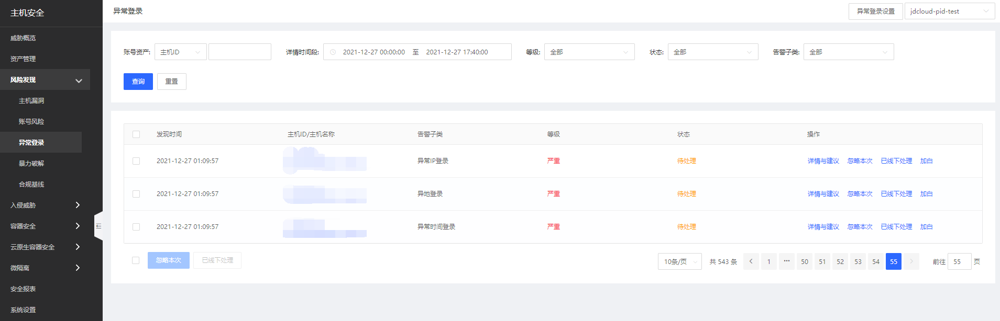
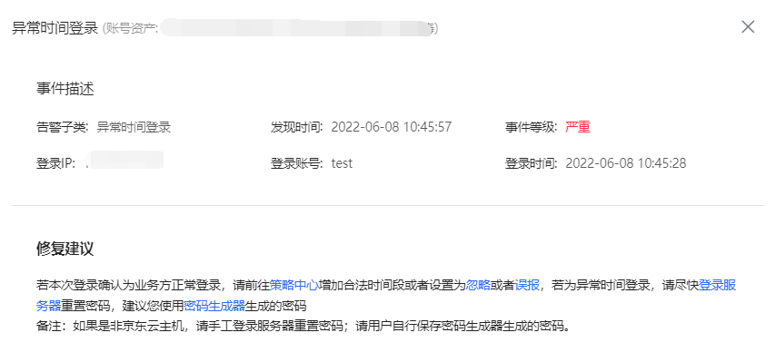
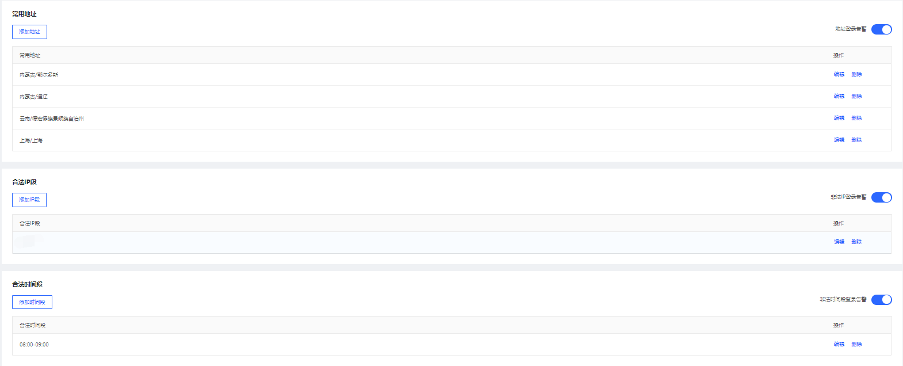

## 异常登录

根据系统设置规则自动识别异常登录行为并预警，用户可以设置常用登录地区、合法登录IP、合法登录时间，当出现登录地址为非常用登录地，登录IP为非法IP，登录时间为非法时间，则产生告警记录，上报到云平台提醒用户存在异常登录风险。

#### 产品功能

用户登录主机安全控制台后，点击**风险发现-异常登录**进入异常登录页面；此页面可总览到异常登录告警，单账号可进行忽略本次、已线下处理和加白名单操作，批量账号风险可进行立即扫描、忽略本次、已线下处理操作；支持通过账号资产、详情时间段、等级、状态、告警子类进行查询。 

查看告警事情详情。

#### 异常登录设置

点击异常登录页面右上角【异常登录设置】按钮进行设置；支持常用地址、合法IP、合法时间段增/删/改操作。

