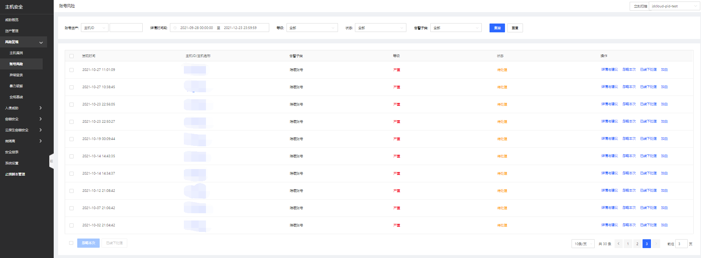
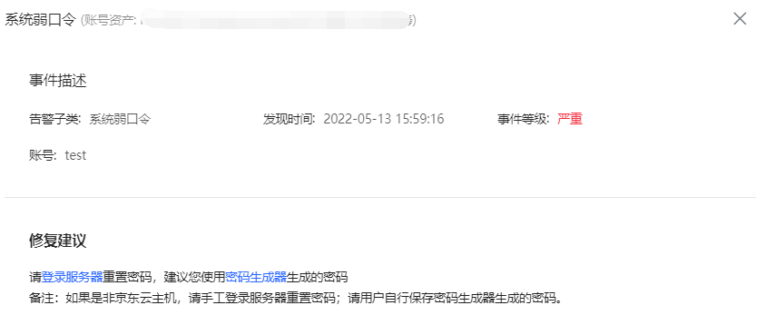
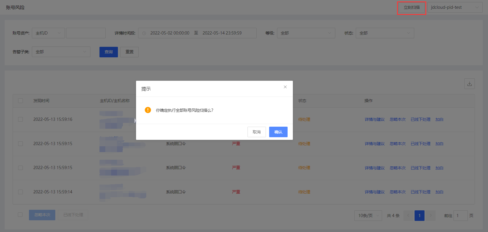

## 账号风险

账号风险主要快速检测弱口令账号，系统内置弱口令字典，根据字典规则对账号口令进行检测，通过云平台展示存在弱口令风险，提醒用户修改，避免系统账号被破解。

#### 产品功能

用户登录主机安全控制台，点击**风险发现-账户风险**进入账号风险页面；此页面可总览到账号风险告警，单账号可进行忽略本次、已线下处理、加白名单操作，批量账号风险可进行立即扫描、忽略本次、已线下处理操作；支持账号资产、详情时间段、等级、状态、告警子类进行查询。 

- 点击详情与建议，帮助用户修复相关安全问题

- 点击【立刻扫描】，手工触发系统弱口令扫描

