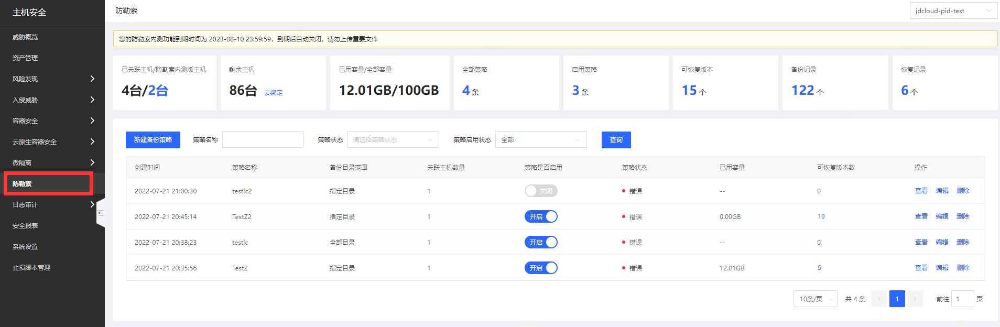
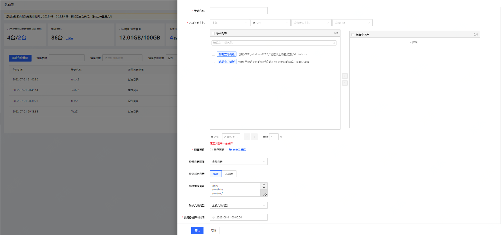
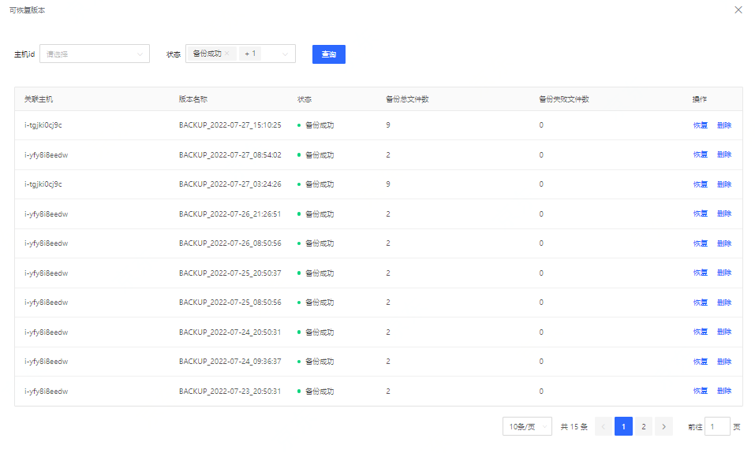
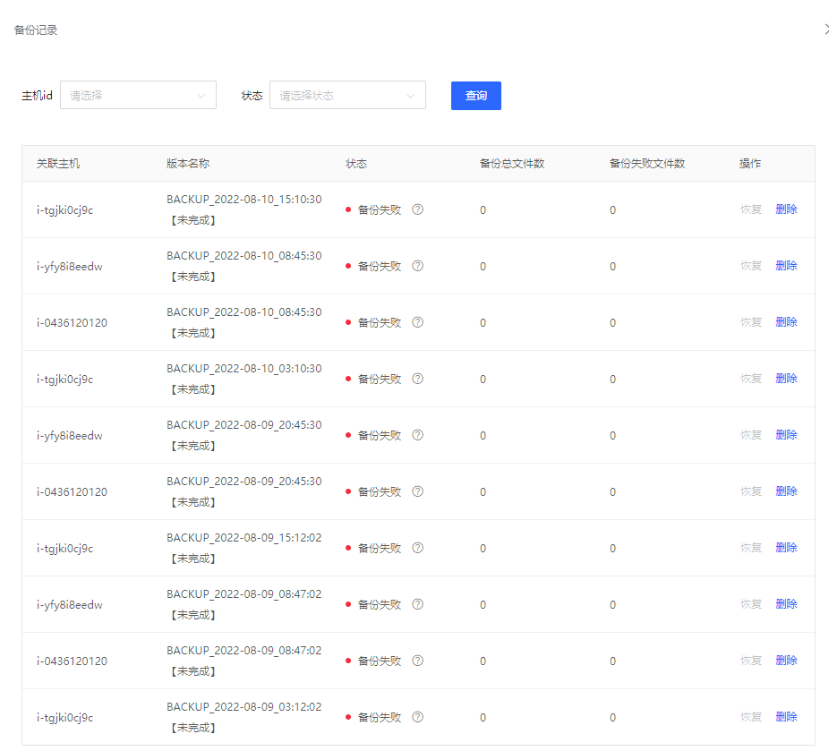
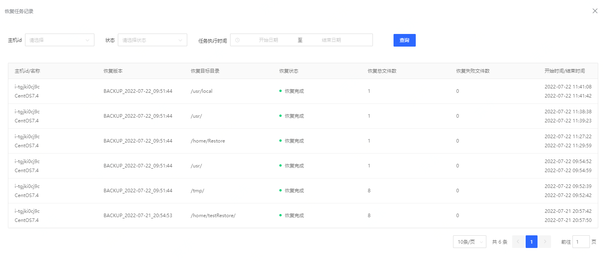

# 防勒索

京东云主机安全防勒索版本，支持对已知勒索病毒的告警和拦截，支持释放诱饵文件，诱捕可能存在的勒索病毒。若您的服务器不慎被勒索病毒入侵，您可以使用云备份服务恢复数据，保障业务不中断。

### 功能说明

登录主机安全控制台后，点击防勒索，页面展示防勒索主机看板信息，列表展示备份策略创建时间、策略名称、备份目录范围、管理主机数、策略是否启用、策略状态、已用容量、可回复版本数等；

**【看板说明】**
类型|描述
:---|:---
1、已关联主机| 即策略绑定的主机总数，不重复计数
2、旗舰版主机| 绑定旗舰版的主机数量
3、剩余主机| 为绑定旗舰版的主机数
4、已用容量| 已备份占用的容量GB
5、全部容量| 购买的容量总和，企业版默认赠送20GB每台，可单独购买容量
6、全部策略| 点击后跳转全部策略页面
7、启用策略| 点击后筛选开启的策略
8、可恢复版本| 点击后打开版本列表
9、备份记录| 点击后跳转全部备份记录
10、恢复记录| 点击后在可恢复版本列表筛选已恢复的状态

**【新建备份策略】**

字段|描述
:---|:---
1、策略名称| 请输入备份名称，如某业务系统数据，限30个字
2、选择关联主机| 支持全选，分组，，防勒索功能可以关联的主机需是绑定防勒索版本的主机列表，其余主机不显示
3、配置策略| 推荐策略（全部目录/排除默认/当时/一天/保存7天/带宽0），自定义策略
4、备份目录范围| 全部目录/指定目录
5、排除指定目录| 排除/不排除
6、备份开始时间| 年月日时分秒，默认当时
7、策略执行频率| 12小时，一天，三天，七天
8、数据保留时间| 永久保存/按天（默认7天）
9、备份网络带宽限制| 默认0(MByte/s)

**【可恢复版本】**

筛选支持通过主机id检索、支持状态筛选：备份完成、部分备份完成

点击【恢复】按钮，打开弹窗，创建恢复完成后，该策略状态变为恢复中

字段说明：

- 选择恢复版本：可以选择该策略下的所有可恢复版本

- 选择恢复文件：支持单选及多选

- 选择文件恢复主机：提示内容 仅能将文件恢复至绑定防勒索版本的主机

- 文件恢复位置：填写需要将文件恢复的目录位置

**【备份记录】**

点击看板区域备份记录，展示所有备份记录信息，支持筛选备份状态、主机id；备份失败原因：点击？号弹窗展示。

**【恢复记录】**

点击看板区域回复记录，展示恢复记录信息，支持通过状态、主机id；任务执行时间赛查。

