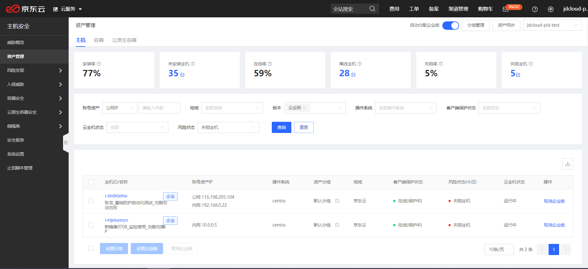
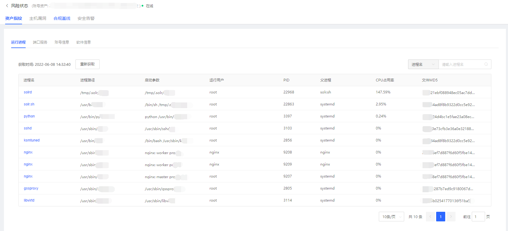
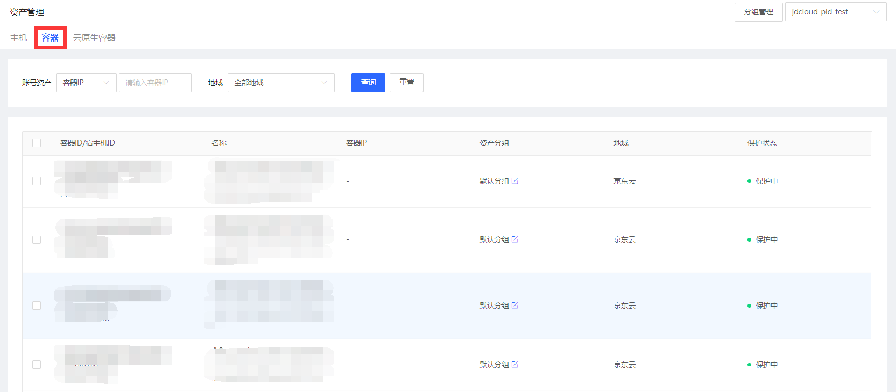

## 资产管理

#### 主机资产管理

用户登录主机安全控制台后，点击**资产管理-主机**进入主机资产管理页面。展示主机安装率、未安装主机、在线率、离线主机、失陷率、失陷主机和相关明细。可以根据账号资产、地域、版本、操作系统、客户端保护状态、风险状态进行查询，支持主机资产分组管理、资产同步、设置企业版、列表导出操作。

查询指定资产：【企业版】支持对资产指纹（进行进程、端口服务、账号信息、软件信息）、主机漏洞、合规基线、安全告警的资产查询。

#### 容器管理

在资产管理-容器中，统计了各类容器资源。可以根据账号资产、地域进行查询，支持分组管理操作。

#### 云原生容器

在**资产管理-云原生容器**中，统计了各类云原生容器资源。可以根据账号资产、地域、客户端保护状态、操作系统进行查询操作；支持设置企业版服务。

