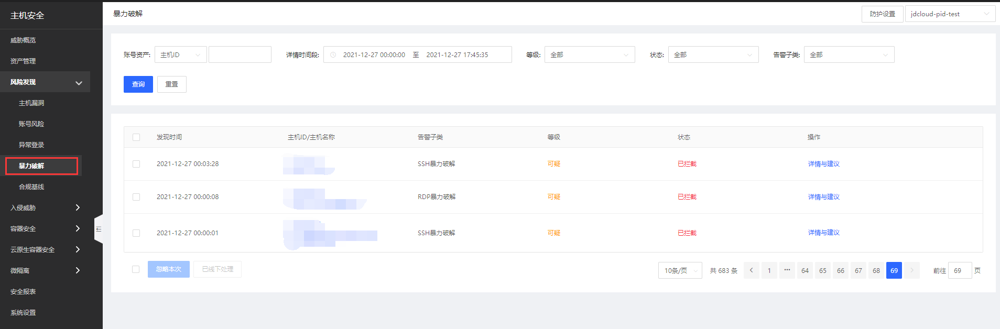
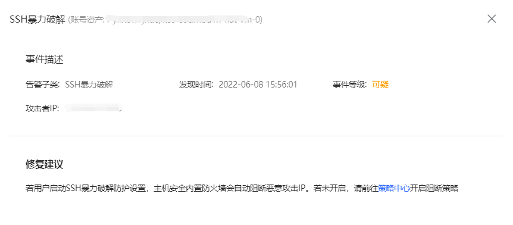
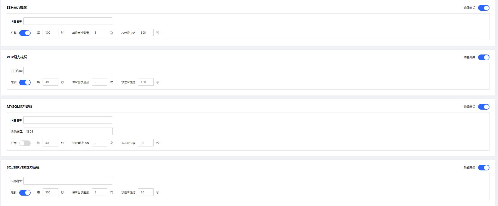

## 暴力破解

对满足暴力破解规则的IP进行拦截，通过系统日志、网络数据包协议分析、端口等方式获取尝试暴力破解的IP，并判断其是否满足防护规则；若满足规则，进行拦截并上报云平台，同时支持用户自定义暴力破解规则，暴力破解成功。

| 功能大项 | 具体功能项|基础版 | 企业版 | 
|---- |-----|----| ----| 
| 暴力破解       |   SSH暴力破解    | * | * |
|         | RDP暴力破解     | * | * |
|         | FTP暴力破解     | * | * |
|         | MYSQL暴力破解     | * | * |
|         | SQLServer暴力破解     | * | * |
| 暴力破解成功       |   SSH暴力破解成功    |   | * |
|         | RDP暴力破解成功     |  | * |

### 功能描述

用户登录主机安全控制台后，点击风险发现-暴力破解进入暴力破解页面；此页面可总览暴力破解告警，支持忽略本次、已线下处理、详情与建议操作；可通过账号资产、详情时间段、等级、状态、告警子类进行查询。

- **详情与建议**

   点击【详情与建议】，可查看具体安全事件详情和修复建议。

- **防护设置**

   点击暴力破解页面右上角“防护设置”按钮进行设置；通过对SSH暴力破解、RDP暴力破解、MYSQL暴力破解、SQLSERVER暴力破解设置（例如：x秒内单IP尝试登录x次，攻击IP冻结x秒），可对攻击IP进行冻结。

