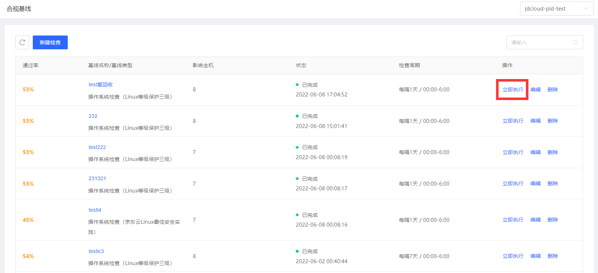

## 合规基线

合规基线帮助用户完成对云主机所运行的服务基本安全配置检测，缩小攻击面。将租户使用频率最高的基本配置检测呈现给用户，让租户对云主机操作系统安全配置有直观的了解，预防由于配置疏忽导致的入侵事件。

#### 功能描述

1、支持一键任务化基线检测，检查结果可视化呈现。

2、自动跟踪配置状态的变更，大大提升了管理效率。

3、参考国内外基线检测最佳实践，满足监管机构合规审计要求。

#### 产品功能入口

用户登录主机安全控制台后，点击**风险发现-合规基线**展示合规基线检查（操作系统）结果，支持单项立即执行、编辑、删除操作。

#### 新建检查任务

通过风险发现-合规基线页面,点击左上角【新建检查】

检查周期：支持每隔1天、每隔7天、每隔30天、执行1次

检查时间段：根据用户业务高峰的不同，支持0:00~6:00、6:00~12:00、12:00~18:00、18:00~24:00 四个时段。

基线类型：支持Linux等级保护三级、Windows等级保护三级、京东云Linux最佳安全实践、京东云Windows最佳安全实践。

检查范围:根据【资产管理】中分组管理创建分组信息配置

#### 执行检查任务

1、根据租户对云主机合规基线检测项的不同需求，可忽略、批量忽略单个检查项，同时，当检查项需求发生变化时，可取消忽略、批量取消忽略单个检查项。

2、如果设定周期性任务扫描，可以提前执行扫描任务。

#### 检查结果呈现

检查项视角呈现检查结果（检测项视角、主机视角）。

未通过项：未通过的检测项数量

影响主机：存在未通过检查项的主机数量

- **检测项视角**

- **主机视角**

