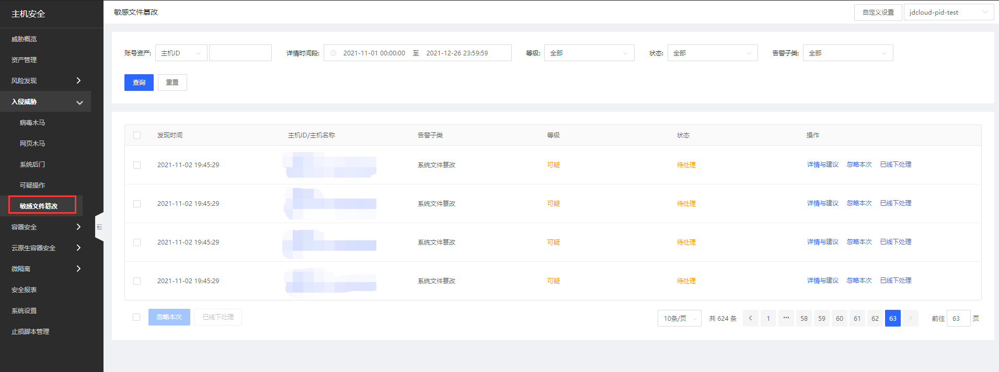
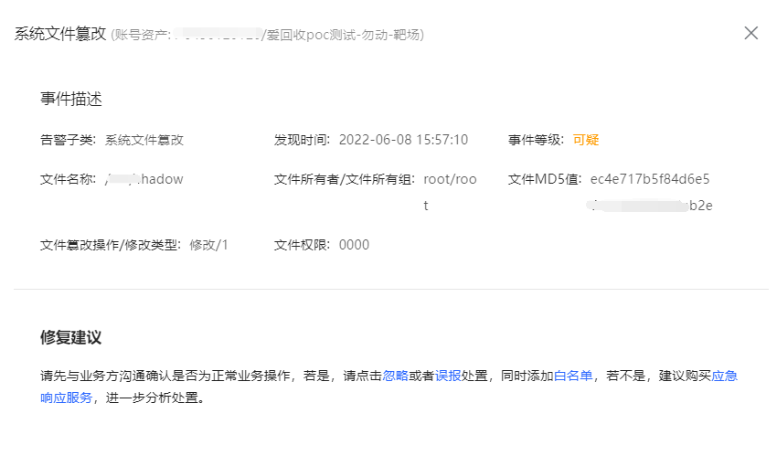

## 敏感文件篡改

实时监控敏感目录及文件，对异常的读取、写入、删除等敏感操作进行告警，支持系统文件篡改：检测Bash、ps命令进程是否被恶意替换，隐藏的非法进程运行等，支持用户自定义文件篡改监控。

#### 功能描述

1、实现 PCI-DSS 等法规和隐私标准的合规性

2、监控特权用户的活动，检测并中断潜在的威胁

3、更快地检测关键文件、系统和应用程序的更改

4、支持监控文件完整性，可发现删除文件、修改文件、新增文件等文件完整性异常行为

#### 产品功能入口

登录主机安全控制台后，点击**入侵威胁-敏感文件篡改**可总览到所有篡改告警，支持查看详情与建议、忽略本次、已线下处理操作，批量账号风险可进行忽略本次、已线下处理操作；可通过账号资产、详情时间段、等级、状态、告警子类进行查询；点击可跳转查看详情处理。 

**【详情与建议】**

**【自定义设置】**

通过敏感文件篡改页面右上角“自定义设置”入口进行设置；通过添加监控名称、监控路径完成设置。

