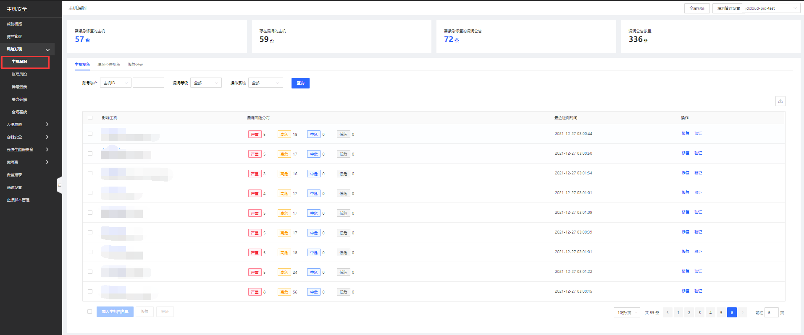

## 主机漏洞

Linux、windows系统中高危漏洞检测与修复；linux漏洞检测：对标CVE官方漏洞库，采用自研版本匹配引擎进行软件版本比对，对当前使用的软件版本中存在的漏洞进行告警。windows漏洞检测：同步微软官网补丁源，对高危及有影响的漏洞进行检测和提醒。支持一键修复。

#### 产品功能

用户登录主机安全控制台后，点击**风险发现-主机漏洞**展示需紧急修复的主机、存在漏洞的主机、需紧急修复的漏洞、漏洞公告数及相关明细。支持修复、验证、导出操作。

- 需紧急修复的主机（支持通过账号资产、漏洞等级、操作系统进行查询，点击列表主机名称可查看明细并进行修复操作）

- 需紧急修复的漏洞（支持通过漏洞公告/CVE编号、标签、漏洞等级、操作系统进行查询，点击漏洞公告可查看明细并修复操作）。

- 修复记录（支持通过漏洞公告、漏洞等级、修复状态、账号资产、详情时间段、操作系统进行查询）

- 漏洞管理设置（通过添加服务器名称/ID完成漏洞设置）

