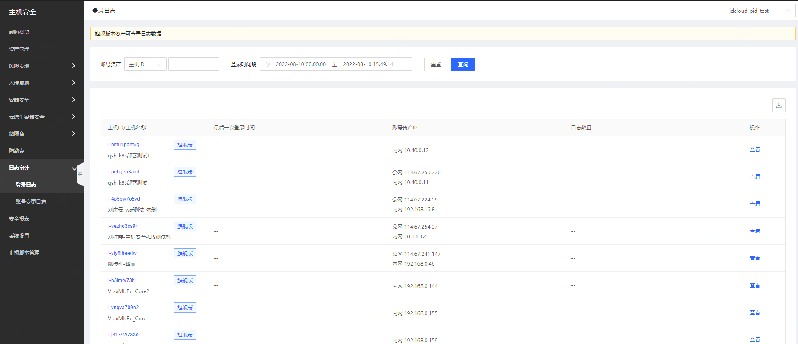
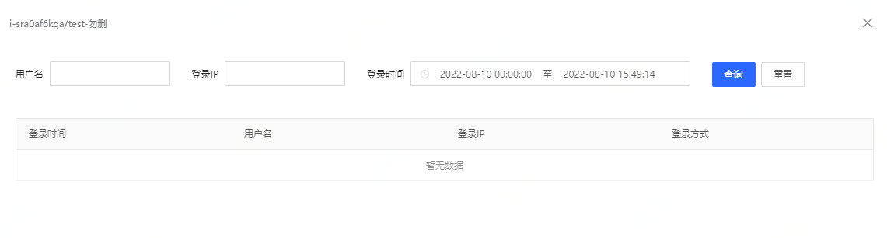
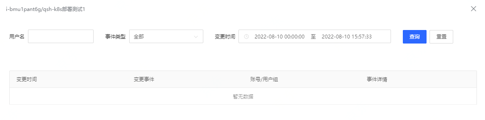

# 日志审计

**【登录日志】**

登录主机安全控制台后，点击【日志审计】-【登录日志】展示主机ID/名称、检测时间、资产IP、日志数量、操作；支持通过账号资产、登录时间段筛查。

点击操作列的【查看】按钮，展示日志详情列表；支持检测用户名、登录ip、登录时间查询。

**【账号变更日志】**

登录主机安全控制台后，点击【日志审计】-【账号变更日志】展示主机ID/名称、检测时间、资产IP、日志数量、操作；支持通过账号资产、登录时间段筛查。

点击操作列的【查看】按钮，显示变更时间 、变更事件、账号/用户组、事件详情；筛选支持用户名、事件类型、变更时间。

