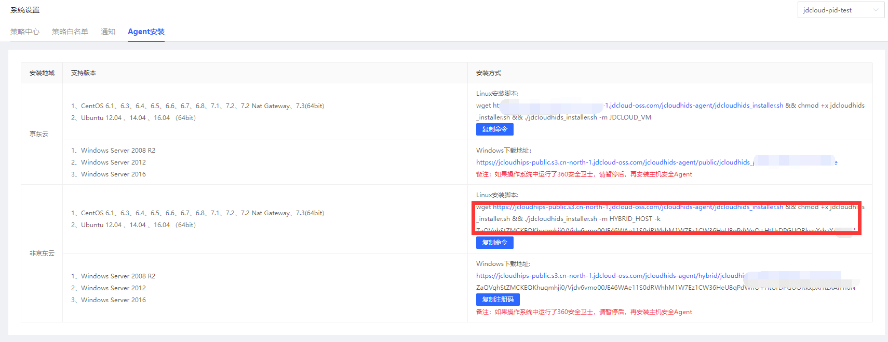
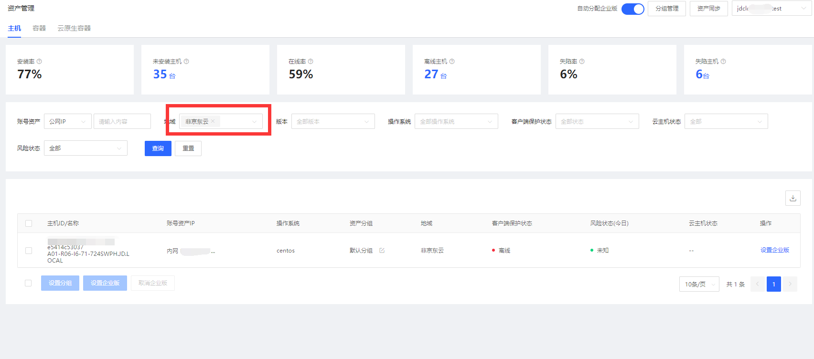

## 多云安装指南

京东云镜像存在主机安全，正常情况客户端在启动的时候就已安装。如果没有安装，请安装京东云客户端。

#### 产品功能入口

进入控制台->【主机安全】->【系统设置】->【Agent安装】 

##### windows安装

下载并安装，安装过程中复制注册码完成。

##### linux安装

如图所示，点击复制命令，在linux服务器上命令行中粘贴。

##### 安装验证

进入控制台->【主机安全】->【资产管理】->【主机】 

