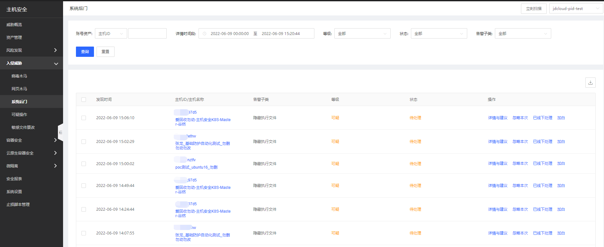
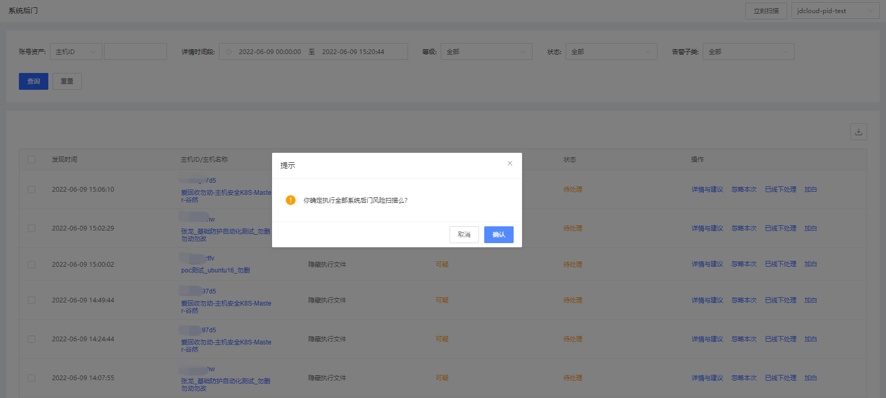
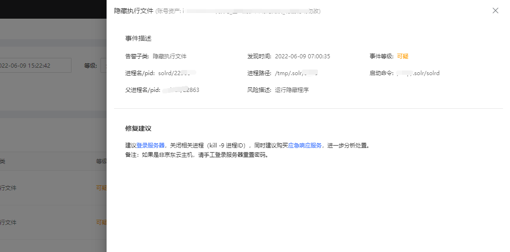

## 系统后门检测

#### 功能描述

1、检测能力：在系统上检测到rootkit越来越难，作为杀毒软件的补充，系统后门检测能力帮助用户深度检测系统文件是否被篡改，是否存在已知的rootkit程序，是否存在隐藏进程、隐藏网络通讯。

2、支持全部云主机系统后门检测扫描。

#### 产品功能入口

用户登录主机安全控制台后，点击**入侵威胁-系统后门**进行总览所有告警，支持对单主机查看详情与建议、进行忽略本次、已线下处理和加白名单操作，批量账号风险可进行立即扫描、忽略本次、已线下处理操作；支持账号资产、详情时间段、等级、状态、告警子类进行查询；点击可跳转查看详情处理。 

点击【立刻扫描】，启动对所有主机后门检测扫描。

点击【详情与建议】，可看到针对该威胁类型具体的安全事件描述。

