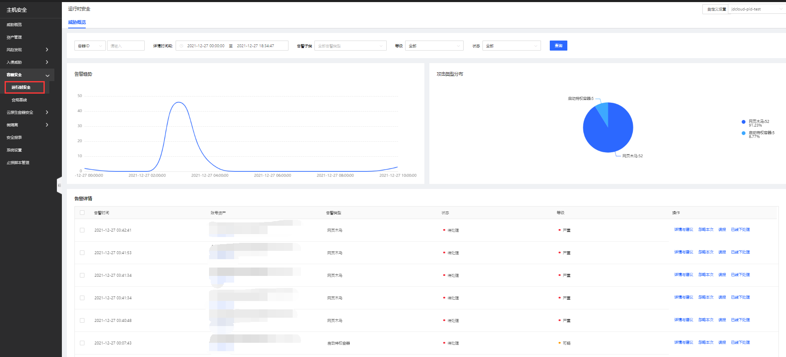
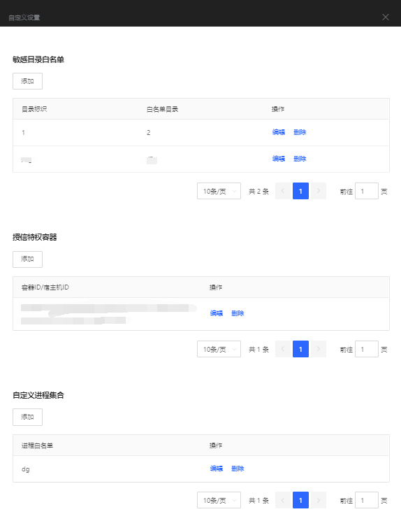
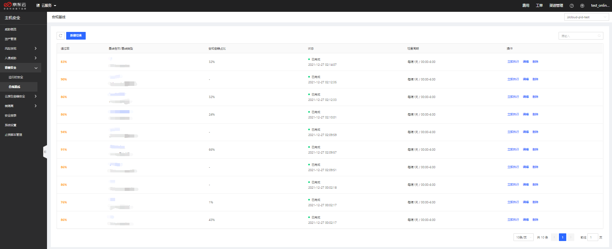

# 容器安全

帮助用户完成对容器所运行时和基础服务安全配置检测，将容器告警信息、攻击情况呈现展示。

#### 运行时安全

用户登录主机安全控制台后，点击**容器安全-运行时安全**展示容器告警信息、攻击情况；此页面可总览到所有告警及相关告警详情，告警详情支持详情与建议、忽略本次、误报、已下线处理操作；支持容器ID、详情时间段、告警子类、等级、状态进行查询，点击可跳转查看详情处理。

【自定义设置】

用户在自定义设置时，通过添加敏感目录白名单、授信特权容器、自定义进程集合完成设置。

#### 合规基线

登录主机安全控制台后，点击**容器安全-合规基线**进入合规基线页面；此页面展示新增合规基线检查结果，支持单项立即执行、编辑、删除操作。点击单任务可查看详情，详情包含：通过率、未通过项、合规容器占比、合规容器及对应操作。 

