# 云原生容器安全

帮助用户完成对云原生容器所运行时和基础服务安全配置检测，将容器告警信息、攻击情况呈现展示。

### 一、运行时安全

用户登录主机安全控制台后，点击云原生容器安全-运行时安全展示容器告警信息、攻击情况；页面可总览到所有告警及详情，支持容器ID、详情时间段、告警子类、等级、状态进行查询；点击可跳转查看详情处理。

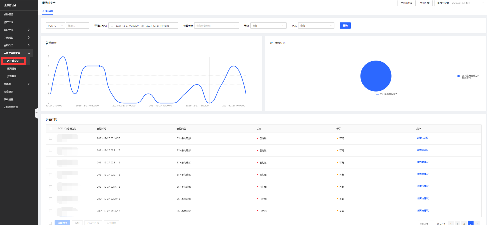

**文件隔离箱**：入口在运行时安全页面右上角

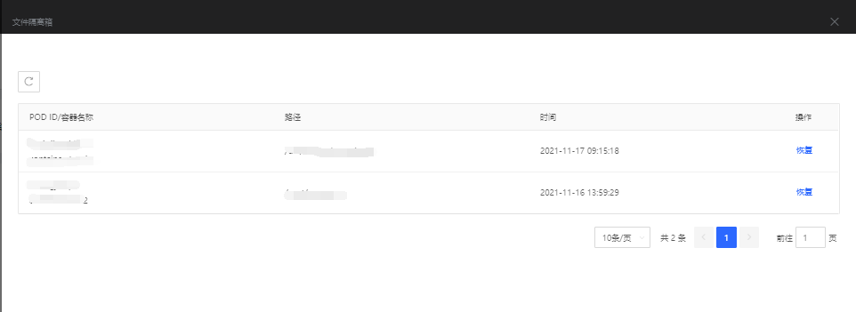

**自定义设置**：支持，异常登录、暴力破解、敏感文件篡改设置。

- **异常登录**支持添加多个地址、合法IP、合法时间段设置。

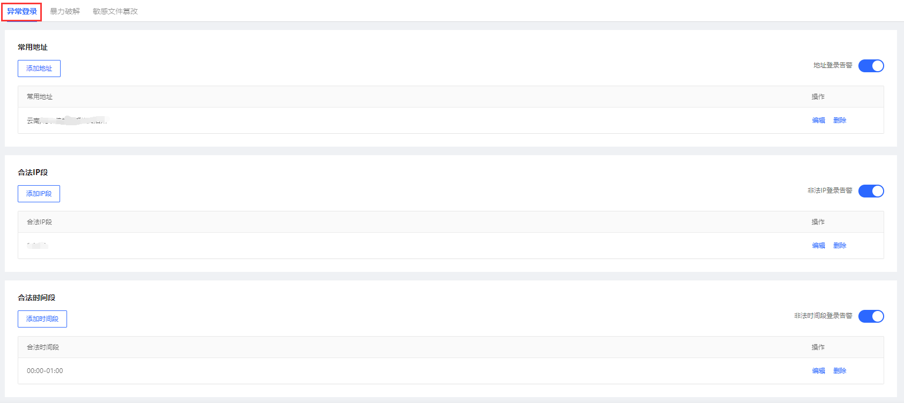

- **暴力破解**对SSH暴力破解/MYSQL暴力破解设置IP白名单、检测端口、规则（每x秒，单IP尝试登录x次，攻击IP冻结x秒）完成设置。

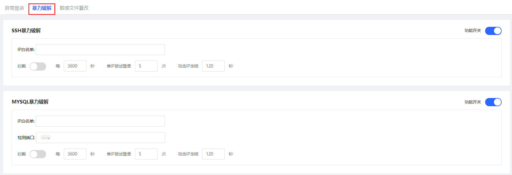

- **敏感文件篡改**通过对自定义文件/系统文件监控白名单设置监控目录操作。

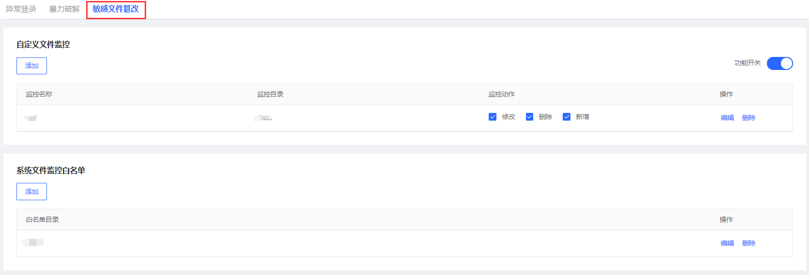

### 二、漏洞扫描

【云原生容器视角】

登录主机安全控制台后，点击**云原生容器安全-漏洞扫描-云原生容器视角**展示云原生容器视角内容；页面展示POD ID/容器名称、漏洞风险分布、检测时间、操作，支持账号资产、漏洞等级、操作系统进行查询。

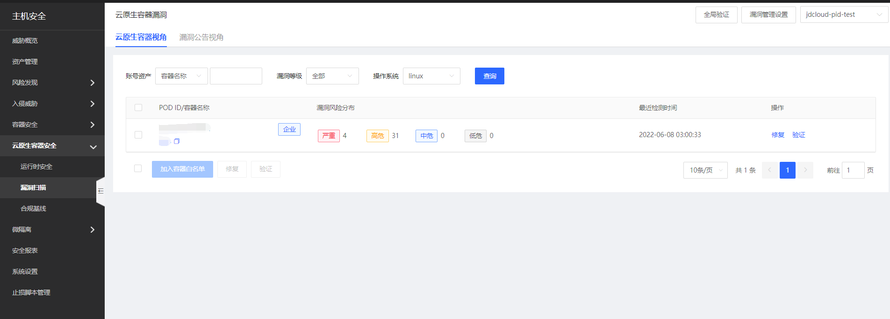

【漏洞公告视角】

登录主机安全控制台后，点击云原生容器安全-漏洞扫描-漏洞公告视角展示漏洞公告内容；展示漏洞公告、漏洞等级、关联账号资产、发现时间、操作，支持漏洞公告、标签、漏洞等级、操作系统查询。

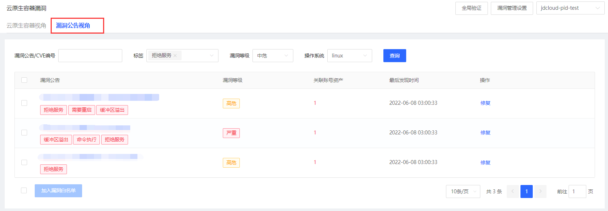

【漏洞管理设置】

点击页面右上角“漏洞管理设置”入口，添加POD ID及容器名称设置白名单设置。

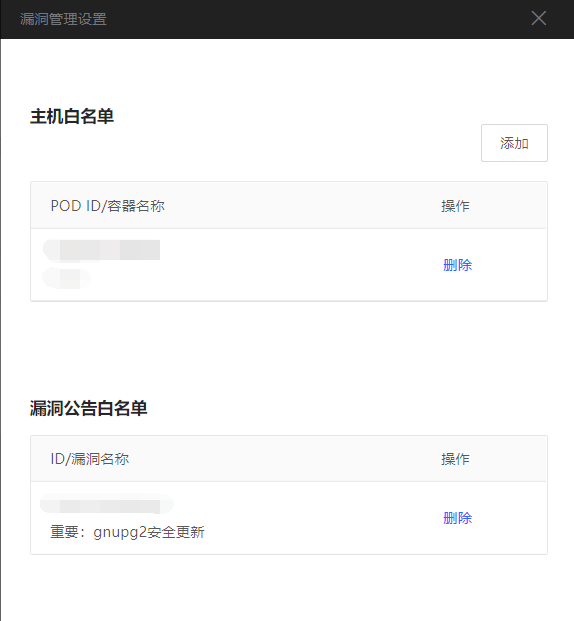

### 三、合规基线

登录主机安全控制台后，点击云原生容器安全-合规基线进入合规基线页面；此页面展示新增合规基线执行结果，支持立即执行、编辑、删除操作。点击基线名称可查看详情，详情包含：通过率、未通过项及对应操作。

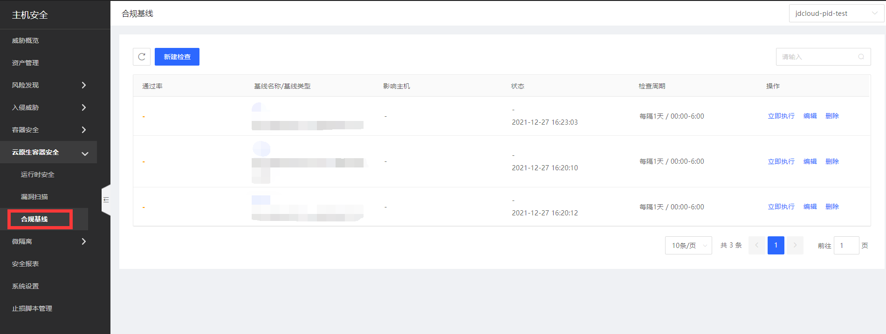

【新建检查】

检查周期：支持每隔1天、每隔7天、每隔30天、执行1次

检查时间段：根据用户业务高峰的不同，支持0:00-6:00、6:00-12:00、12:00-18:00、18:00-24:00 四个时段。

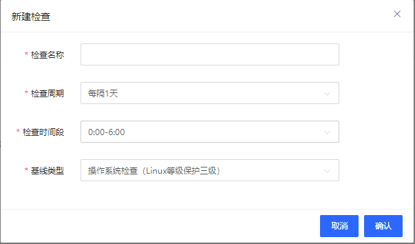

【详情】：点击名称查询详情。

- 检测项视角

- 容器视角

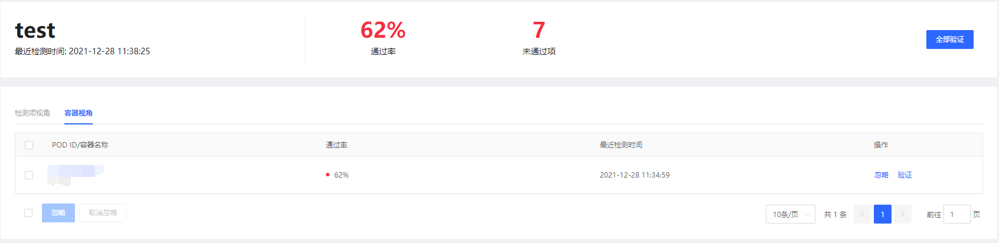

