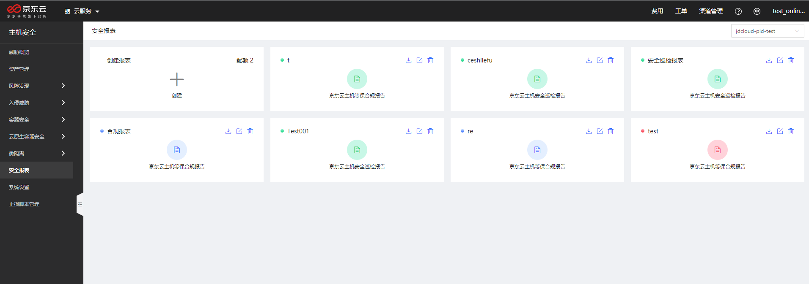
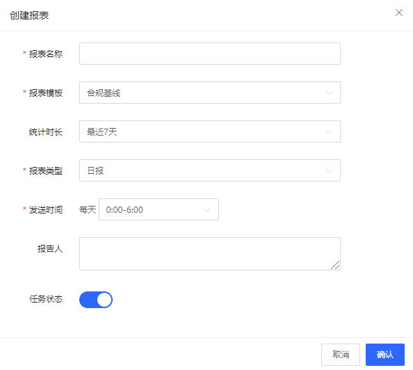
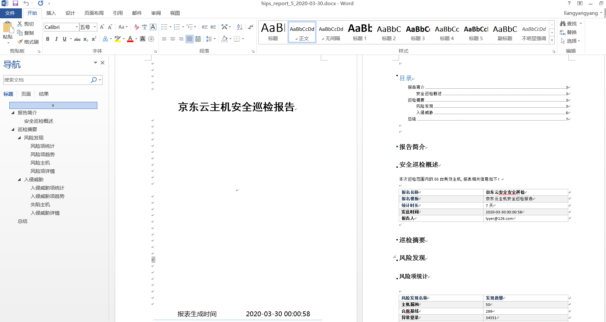

## 安全报表

#### 功能描述

| 类别 | 功能描述|
|---- |-----|
| 合规基线       |   合规基线报表用于导出基线任务中的基线规则检查详情，以帮助用户对合规情况进行分析和响应   | 
| 安全巡检       |   安全巡检主要是对评估范围内的服务器进行安全扫描，对被评估对象进行一系列的安全分析与探测，以发现目标存在的安全隐患并确实的告知修复建议，提升安全等级     | 

#### 产品功能入口

登录主机安全控制台后，点击安全报表进入报表聚合页；此页面展示已创建的报表任务，支持对报表任务新建、编辑、删除、下载操作。

#### 操作指导

【创建】下发报表生成调度任务。

填写报表名称，选择报表模板，设置统计时长、报表类型、发送时间，填写报告人的电子邮件。

- 报表模板：合规基线、安全巡检；

- 统计时长：最近7天、最近1个月；

- 报表类型：支持日报、周报、月报；

- 发送时间：根据业务高峰的不同，支持0:00-6:00、6:00-12:00、12:00-18:00、18:0-024:00 四个时段。

【下载报表】

