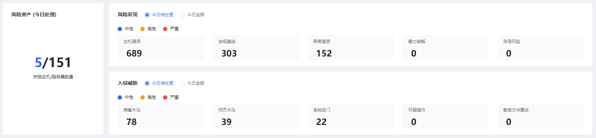
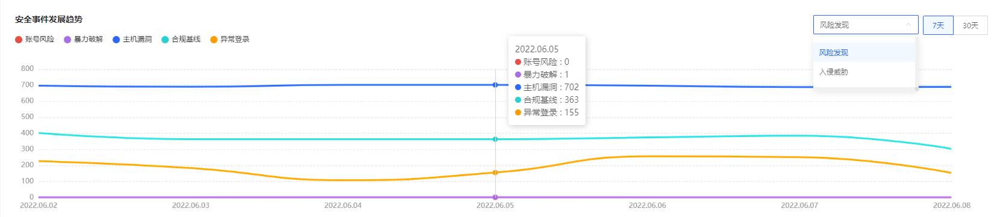
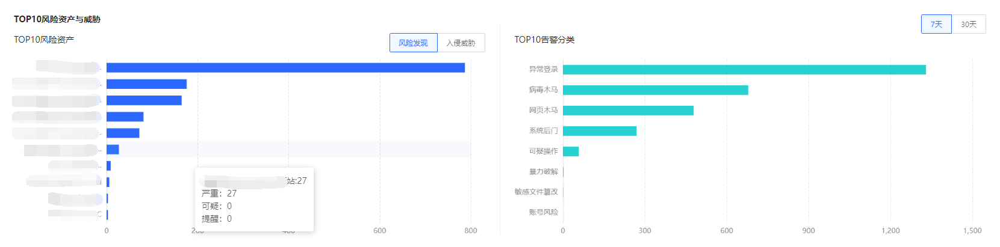
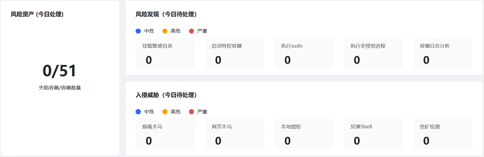
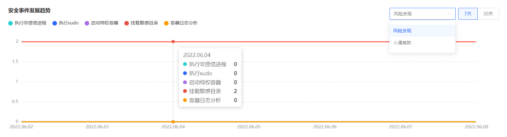
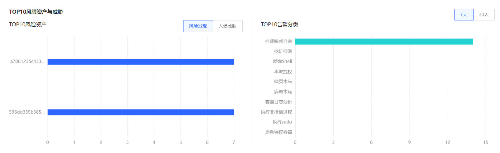

# 威胁概览

### 产品功能入口

用户进入主机安全控制台，点击威胁概览，默认展示主机威胁概览，可切换查看**主机/容器**概览信息。

主机概览展示风险资产、待解决风险、安全事件发展趋势（主机包含：账号风险、暴力破解、主机漏洞、合规基线、异常登录）、TOP10风险资产、TOP10告警分类；

容器概览展示挂载敏感目录、启动特权容器、执行sudo、执行非授信进程、容器日志分析）、TOP10分析资产、TOP10告警分类。
 

### 主机威胁概览

点击**主机安全-威胁概览-主机**展示主机风险资产信息。

【主机风险资产】

此卡片主要展示今日待处理的风险资产、风险发现、入侵威胁；

1.风险资产展示服务器数量及失陷主机，点击失陷主机可跳转进行处置。

2.风险发现展示当天不同风险等级的主机漏洞、合规基线、异常登录、暴力解决、账号风险，点击可跳转进行处置。

3.入侵威胁展示当天不同风险等级的病毒木马、网页木马、系统后门、可疑操作、敏感文件篡改，点击可跳转进行处置。

【安全事件发展趋势】

此卡片对7天、30天内的风险发现（账号风险、暴力破解、主机漏洞、合规基线、异常登录）、入侵威胁（系统后门、网页木马、病毒木马、可疑操作、敏感文件篡改）单趋势/多趋势展示；

【TOP10分析资产与威胁】

此卡片对7天、30天的TOP10风险资产（风险发现、入侵威胁）、TOP10告警分类进行展示。

### 容器威胁概览

点击**主机安全-威胁概览-容器**展示容器威胁资产信息。

【容器风险资产】

此卡片主要展示今日待处理的风险资产、风险发现、入侵威胁；

1.**风险资产**展示容器数量及失陷容器，点击失陷容器可跳转进行处置。

2.**风险发现**展示当天不同风险等级的挂载敏感目录、启动特权容器、执行sudo、执行非授信进程、容器日志分析的风险，点击可跳转进行处置。

3.**入侵威胁**展示当天不同风险等级的病毒木马、网页木马、本地提取、反弹Shell、挖矿检测，点击可跳转进行处置。

【安全事件发展趋势】

此卡片对7天、30天内的风险发现（挂载铭感目录、执行sudo、执行非授信进程、容器日志分析、启动特权容器）、入侵威胁（本地提权、挖矿检测、反弹Shell、病毒木马、网页木马）单趋势/多趋势展示；

【TOP10分析资产与威胁】

此卡片对7天、30天的TOP10风险资产（风险发现、入侵威胁）、TOP10告警分类进行展示。

