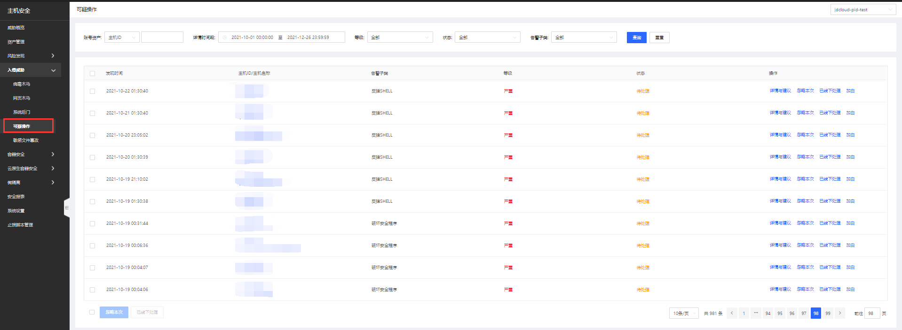

## 可疑操作

#### 功能描述

检测能力：通过审计用户命令行中输入的可疑操作行为，包括：密码文件修改、	恶意文件下载、代理软件滥用、篡改系统日志、篡改ssh密钥、运行黑客工具、反弹shell、信息泄露、高危命令、破坏安全程序、明文密码登录等。

#### 产品功能入口

用户登录主机安全控制台后，点击**入侵威胁-可疑操作**进入可疑操作页面；此页面可总览到所有可疑告警，对单主机查看详情与建议、忽略本次、已线下处理和加白名单操作，批量账号风险可进行忽略本次、已线下处理操作；支持账号资产、详情时间段、等级、状态、告警子类进行查询；点击可跳转查看详情处理。 

