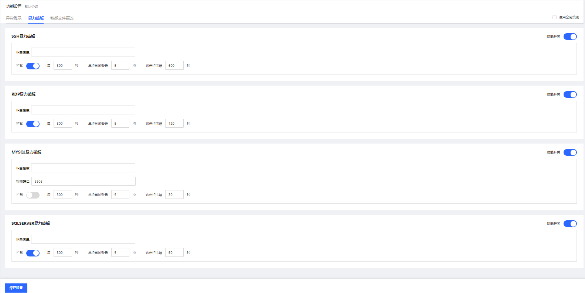
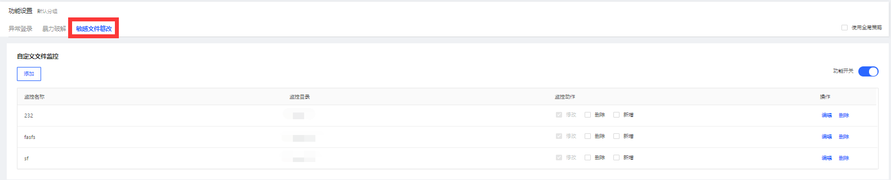
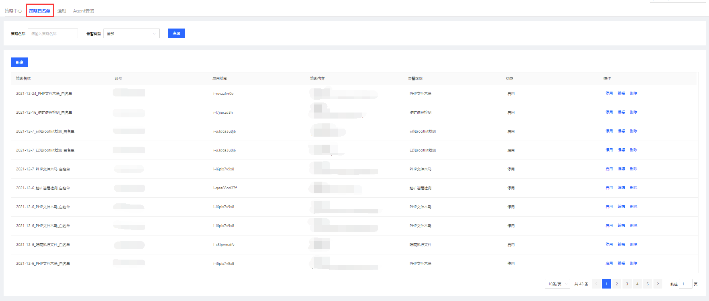
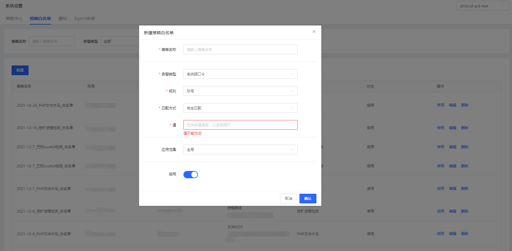
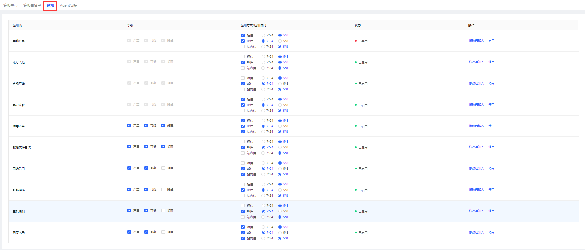
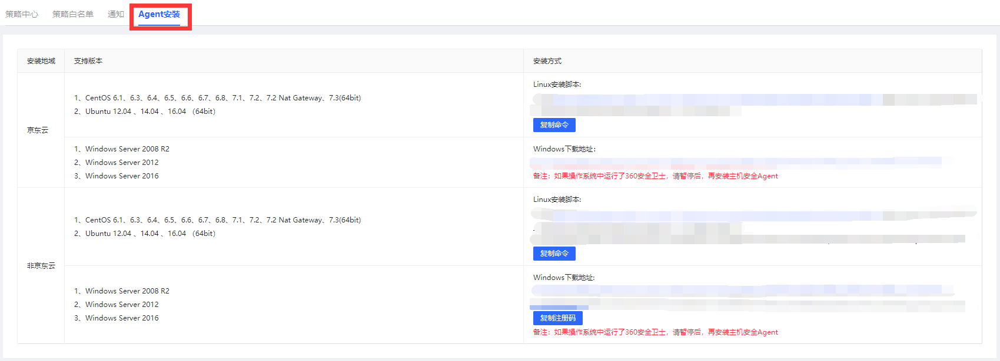

## 系统设置

#### 一、策略中心

【异常登录】

点击策略中心-异常登录设置常用登录地址，合法IP，合法时间段。支持增/删/改操作。

【暴力破解】

1）SSH暴力破解，设置IP白名单、拦截规则（每x秒，单IP尝试登录x次，攻击IP冻结x秒）

2）RDP暴力破解，设置IP白名单、拦截规则（每x秒，单IP尝试登录x次，攻击IP冻结x秒）

3）MYSQL暴力破解，设置IP白名单、端口、拦截规则（每x秒，单IP尝试登录x次，攻击IP冻结x秒）

4）SQLSERVER暴力破解，设置IP白名单、拦截规则（每x秒，单IP尝试登录x次，攻击IP冻结x秒）

【敏感文件篡改】

点击策略中心-敏感文件篡改设置；支持增/删/改助作。

#### 二、策略白名单

点击策略白名单查看所有已创建的策略白名单；支持停用、编辑、删除操作；可通过策略名称、告警类型进行查询。

【新增策略白名单】

填写策略名称、值，选择告警类型、规则、匹配方式、应用范围完成新建。

#### 三、通知

根据自己需要对异地登录、账号风险、合规基线、暴力破解、病毒木马、敏感文件篡改、系统后门、可疑操作、主机漏洞、网页木马设置告警选项；支持修改通知人和启用操作。

#### 四、Agent安装

京东云镜像存在主机安全，正常情况客户端在启动的时候就已安装。如果没有安装，请安装京东云客户端。

- Linux：复制命令，在linux服务器上命令行中粘贴。
- Windows：下载并复制注册码，下载成功后，安装过程输入注册码完成。

