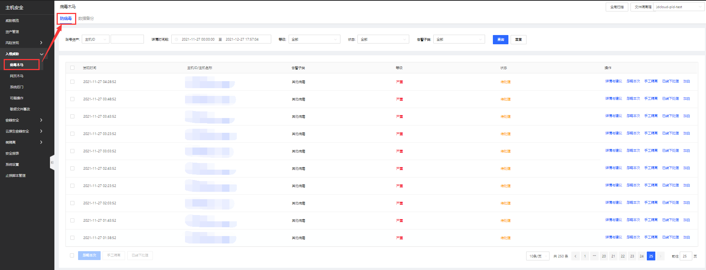
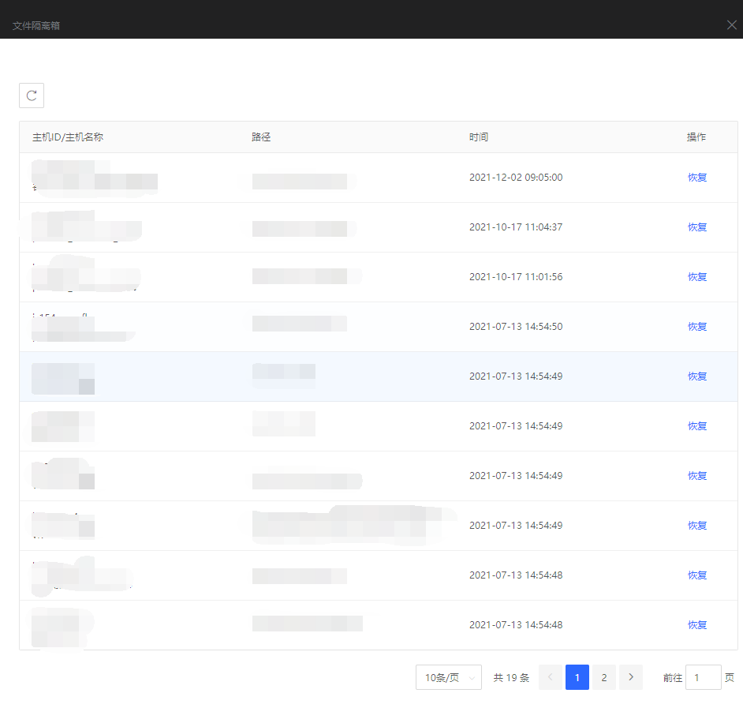
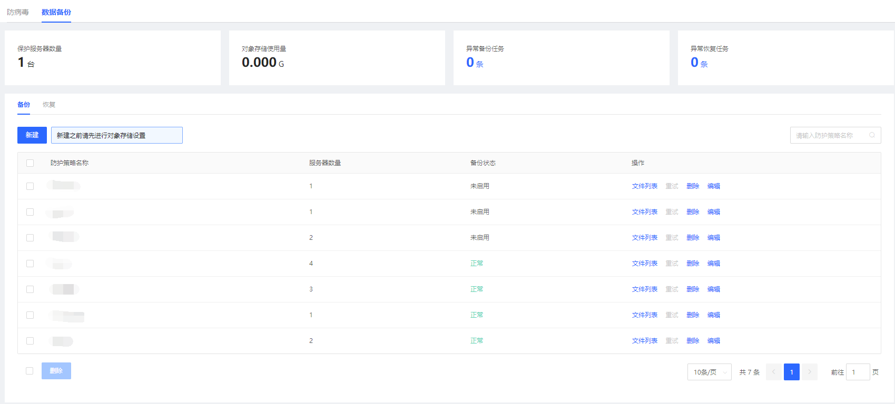
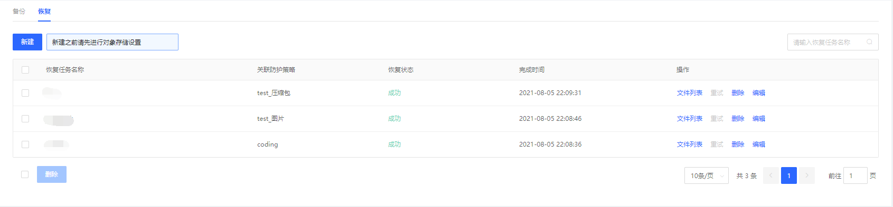
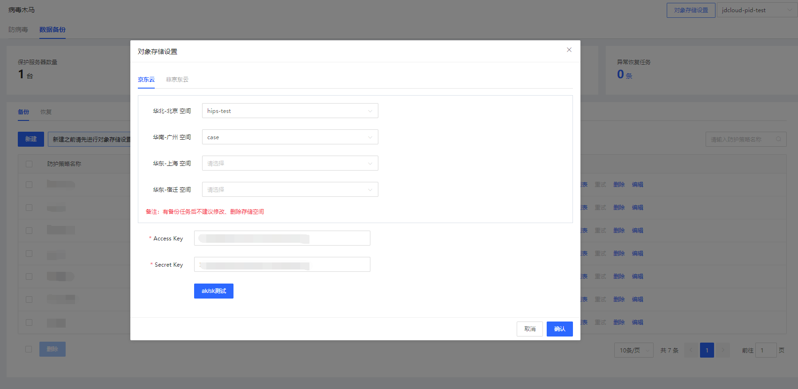
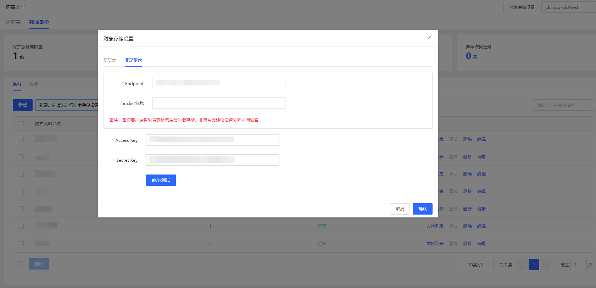

## 病毒木马

#### 功能描述

定期扫描进程并监控进程启动事件，通过云查杀机制检测恶意病毒和木马进程，控制台支持一键隔离恶意文件，同时提供隔离文件恢复功能。

#### 防病毒

用户登录主机安全控制台后，点击**入侵威胁-病毒木马-防病毒**进入防病毒页面；支持账号资产、详情时间段、等级、状态、告警子类进行查询和全局病毒扫描操作；点击可跳转进行处置。

**文件隔离箱**：点击病毒木马-防病毒页面右上角“文件隔离箱”按钮进行查询。

#### 数据备份

用户登录主机安全控制台后，点击**入侵威胁-病毒木马-数据备份**进入数据备份管理页面。数据备份页面展示保护服务器数量、对象存储使用量、异常备份任务、异常恢复任务和相关明细；支持对数据备份进行增/删/改、文件列表详情操作。

点击资产类型与数量可以筛选出资产的详细信息，如下：

【异常备份任务】

【异常恢复任务】

点击数据备份页面右上角“对象存储设置”按钮进行设置（包含京东云、非京东云）。

【京东云数据存储设置】

【非京东云数据存储设置】

