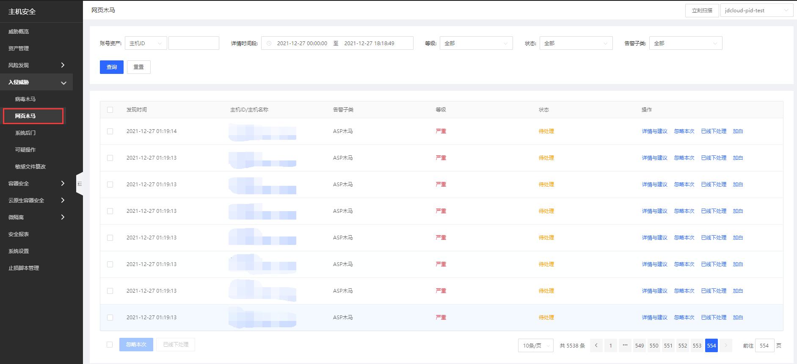
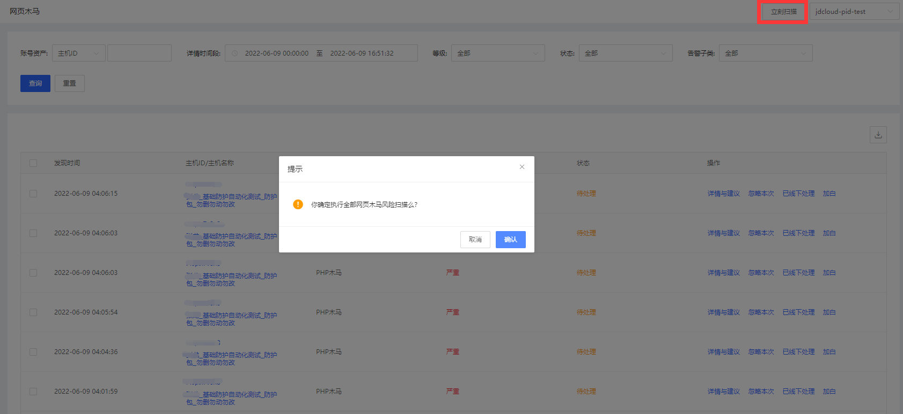

## 网页木马

#### 功能描述

准确识别Web目录下网页木马程序，网页木马功能是采用本地+云端查杀机制，客户端本地通过静态检测引擎发现网页木马，同时对可疑程序上报云端判断。云端网页木马查杀引擎包括：AI查杀引擎和网页木马沙箱检测引擎。

#### 产品功能入口

用户登录主机安全控制台后，点击**入侵威胁-网页木马**进行总览所有网页木马告警，支持对单主机查看详情与建议、进行忽略本次、已线下处理和加白名单操作，批量账号风险可进行立即扫描、忽略本次、已线下处理操作；支持账号资产、详情时间段、等级、状态、告警子类进行查询；点击可跳转进行处置。 

点击【立刻扫描】，对所有云主机web目录进行webshell检测。

