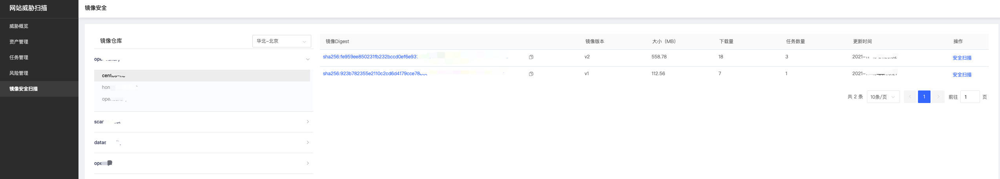
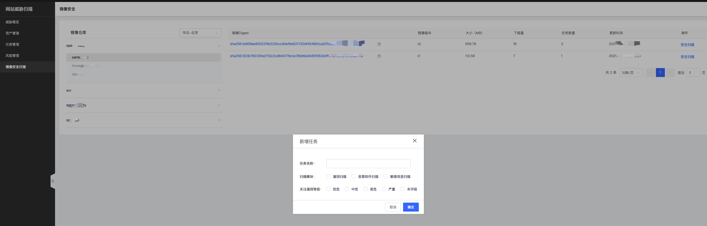
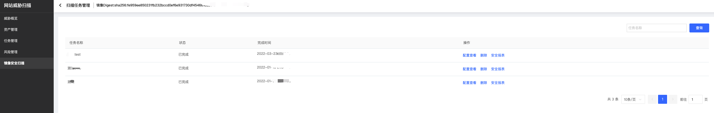
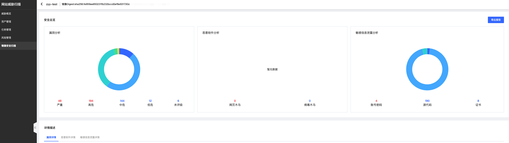

# 镜像安全扫描

​		镜像安全扫描针对京东云上镜像仓库中存在镜像进行实时同步拉取，用户可以灵活选择不同地域（华北-北京、华东-上海、华南-广州）获取镜像仓库中的镜像列表；支持多种架构镜像包括但不限于apline、Amazon、debian、oracle、photon、redhat、suse、ubuntu等多操作系统容器镜像。

### 获取镜像列表

​		自动关联获取当前地域镜像仓库中的镜像信息，包括镜像Digest、镜像版本、镜像大小、镜像下载量

### 创建扫描任务

​		针对镜像支持灵活自定义镜像扫描任务策略，包括自定义扫描任务名称，扫描模块（漏洞扫描、恶意软件扫描、敏感信息扫描）、扫描漏洞级别（严重、高、中、低、未评级）

### 查看镜像结果

​		查看该扫描任务配置项，扫描任务名称、任务状态、任务完成时间

​		查看该扫描任务报表，分别查看任务安全总览（镜像漏洞、恶意软件、敏感信息泄露）以及针对相应扫描检查项对应的检查信息。

