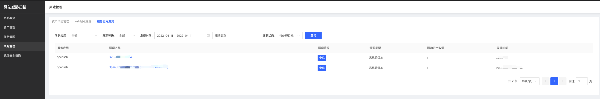
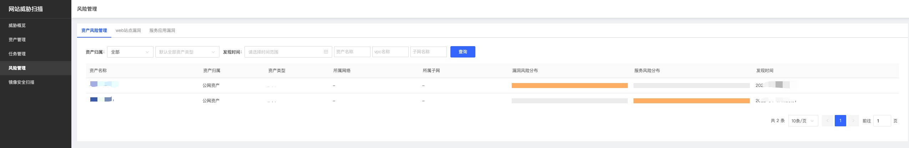

# 威胁概览

​		通过资产风险评估，直观呈现当前全部资产的风险等级（高、中、低）；通过资产漏洞统计，直观呈现当前全部资产漏洞数量；通过风险资产统计，直观呈现当前风险资产的IP、域名的数量等信息。

​		针对已发现漏洞综述、风险资产的IP&域名，结合时间维度，直观呈现当前的发展变化趋势，按照IP资产、域名资产两个维度，结合近一周、近1个月的时间维度，直观呈现当前TOP 10的风险资产，按照漏洞类型分类，结合近一周、近1个月的时间维度，直观呈现当前客户资产中TOP 10的漏洞类型。

		

### 威胁概览&威胁数量

| 内容                   | 描述                                                         |
| ---------------------- | ------------------------------------------------------------ |
| 风险等级               | 当前账号下所有资产平均风险值，风险等级范围：高、中、低       |
| web站点漏洞（待处理）  | 当日待处理的web站点类漏洞（覆盖OWASP Top10 漏洞检测、PoC插件检测等多种漏洞监测类型的） |
| 服务应用漏洞（待处理） | 当日待处理的版本比对类漏洞，针对域名ip资产背后的服务应用的版本进行比对扫描，及时发现存在的组件使用的高风险版本 |
| 漏洞IP                 | 当日存在漏洞的IP资产数量                                     |
| 漏洞域名               | 当日存在漏洞的域名资产数量                                   |

PIN风险值定义

|危险程度 |	危险值区域 |
| ------ | ------ |
|高 |	5<= 漏洞风险值 <= 10
|中 |   3 <= 漏洞风险值 <= 4
|低 |	 1 <= 漏洞风险值 < 3

单个资产风险值定义：

| 风险资产 | 风险定义                                                     |
| -------- | ------------------------------------------------------------ |
| 高危资产 | 存在1个以上高危漏洞 或存在5个以上中危漏洞 或存在10个以上低危漏洞 |
| 中危资产 | 存在0个高危漏洞、存在3个以上、5个以下中危漏洞 或存在0个高危漏洞、存在5个以上、10个以下低危漏洞 |
| 低危资产 | 存在0个高危漏洞、0个中危漏洞、1个以上、5个以下低危漏洞       |

单个漏洞风险值定义：

| 危险程度 | 危险值区域 | 危险程度说明 |
| ------ | ------ | ------ |
| 高 | 8<= 漏洞风险值 <= 10 | 攻击者可以远程执行任意命令或者代码，或进对系统行远程拒绝服务攻击 |
| 中 | 5 <= 漏洞风险值 <= 7 | 攻击者可以远程创建、修改、删除文件或数据，或对普通服务进行拒绝服务攻击 |
| 低 | 1 <= 漏洞风险值 < 4 | 攻击者可以获取某些系统、服务的信息，或读取系统文件和数据 |

### 漏洞发展趋势

显示每天发现漏洞数量、已处理漏洞数量、漏洞IP、漏洞域名的统计数据，显示范围：7天/30天。

### Top10风险资产

分别从IP维度、域名维度显示Top10风险资产，横坐标：漏洞数量。同时支持高中低危等级。  

#### Top10漏洞分类

从漏洞分类角度显示Top10漏洞名称，横坐标：漏洞数量。

#### 威胁数量&威胁对象

点击【威胁数量】->【发现漏洞数量】，跳转到 【风险管理】-> 【web站点漏洞】

  

点击【威胁数量】->【发现漏洞数量】，跳转到 【风险管理】-> 【服务应用漏洞】

  

点击【威胁对象】->【漏洞IP】，跳转到 【风险管理】-> 【资产风险管理】

点击【威胁对象】->【漏洞域名】，跳转到 【风险管理】-> 【资产风险管理】 

