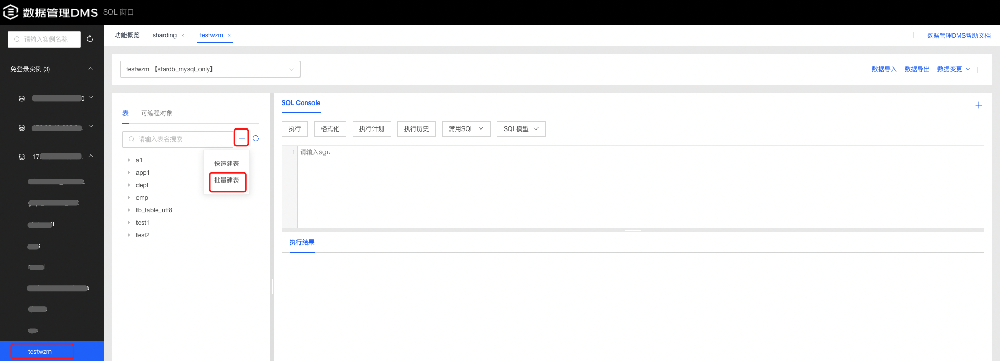
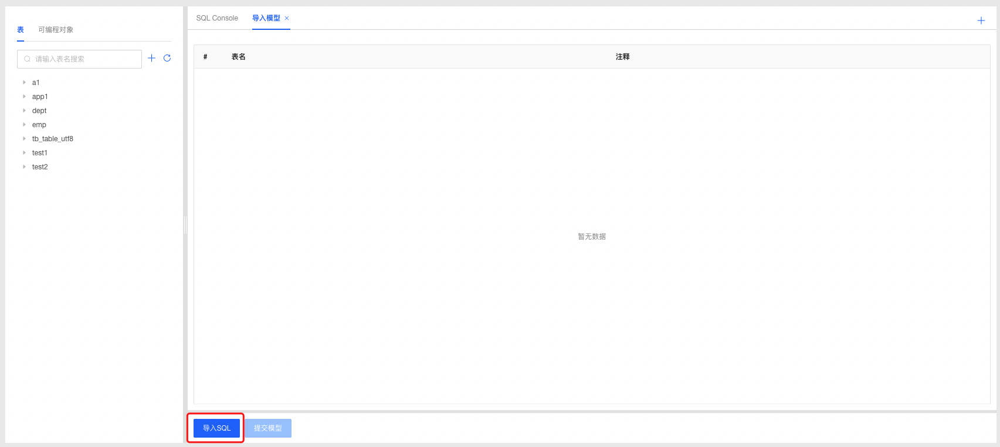
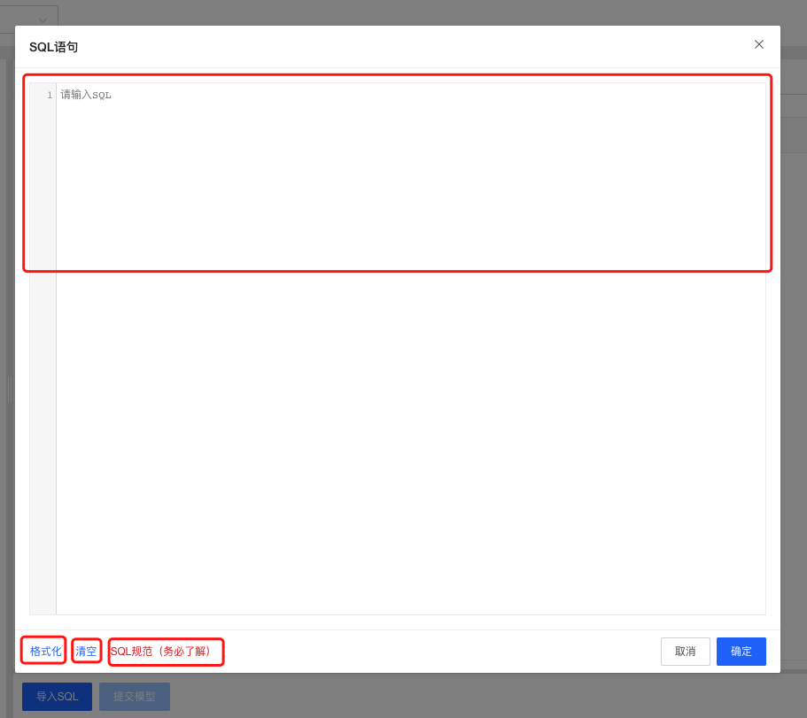
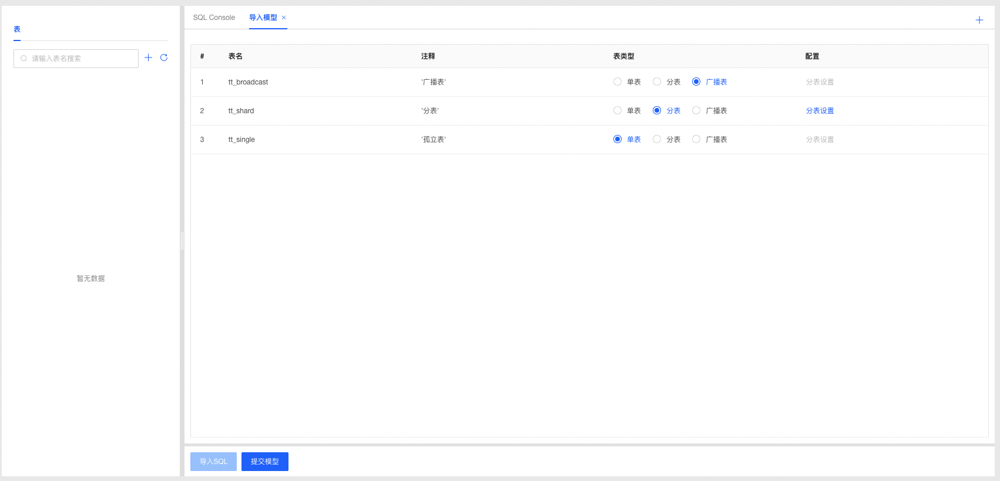
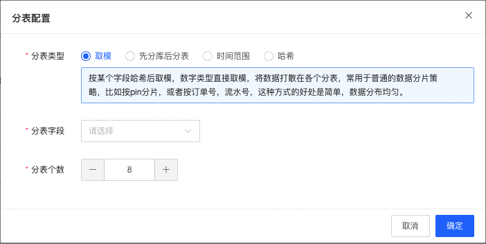
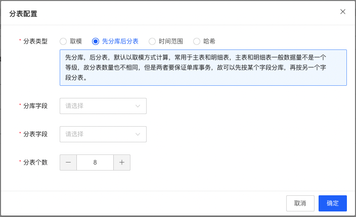
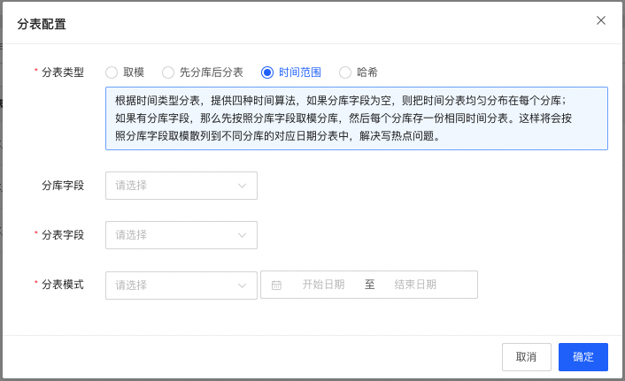
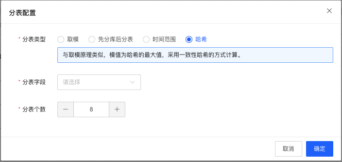
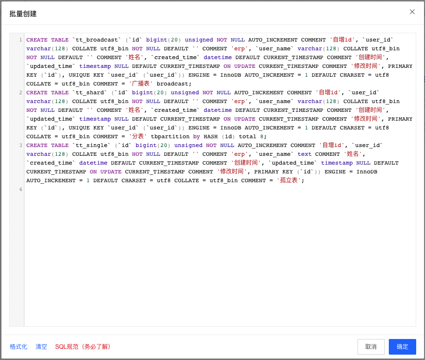
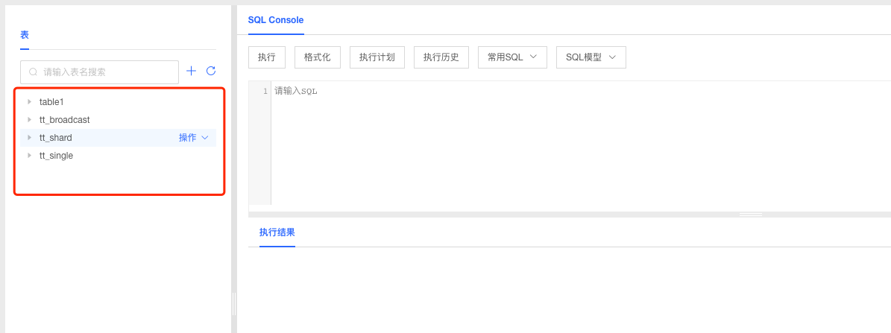

# 分布式建表

目前DMS支持京东云分布式数据库StarDB的分布式建表功能，您可以在使用StarDB数据库时通过DMS提供的**批量建表**功能进行操作。

## 批量建表

1. 选择要操作的数据库，点击新建+按钮选择【批量建表】功能；

   

2. 进入批量建表页面，点击导入SQL进行SQL编辑；

   

3. 在编辑框内编辑建表语句，可以通过【格式化】按钮快速格式化SQL语句，通过【清空】按钮快速清空输入框；如果您不了解SQL规范，可以点击“SQL规范（务必了解）”链接进行查看；

   

4. 输入建表语句后，点击【确认】按钮，系统自动识别表名和注释信息，您可以对表信息进行预览并选择**表类型**，如果选择**分表**，请进行**分表配置**；

   

5. 根据业务需要选择分表类型，设置相应的分表规则；

   - 分表类型：取模

     - 规则说明：按某个字段哈希后取模，数字类型直接取模，将数据打散在各个分表，常用于普通的数据分片策 略，比如按pin分片，或者按订单号，流水号，这种方式的好处是简单，数据分布均匀；
     - 编辑要分表的字段和分表个数后点击【确认】即可完成分表设置；

     

   - 分表类型：先分库后分表

     - 规则说明：先分库，后分表，默认以取模方式计算，常用于主表和明细表，主表和明细表一般数据量不是一个等级，故分表数量也不相同，但是两者要保证单库事务，故可以先按某个字段分库，再按另一个字段分表；
     - 编辑分库字段、分表字段和分表个数后点击【确认】即可完成分表设置；

     

   - 分表类型：时间范围

     - 规则说明：根据时间类型分表，提供四种时间算法，如果分库字段为空，则把时间分表均匀分布在每个分库；如果有分库字段，那么先按照分库字段取模分库，然后每个分库存一份相同时间分表。这样将会按照分库字段取模散列到不同分库的对应日期分表中，解决写热点问题；
     - 编辑分库字段、分表字段和分表模式后点击【确认】即可完成分表设置；

     

   - 分表类型：哈希

     - 规则说明：与取模原理类似，模值为哈希的最大值，采用一致性哈希的方式计算。
     - 编辑要分表的字段和分表个数后点击【确认】即可完成分表设置；

     

6. 表类型和分表设置编辑完成后点击【提交模型】，系统根据表类型和分表规则重新生成批量创建SQL，确认无误后点击【确认】提交后台创建表；

   

7. 创建成功后，系统自动刷新表Tab，您可以对创建后的表进行表管理操作；

   