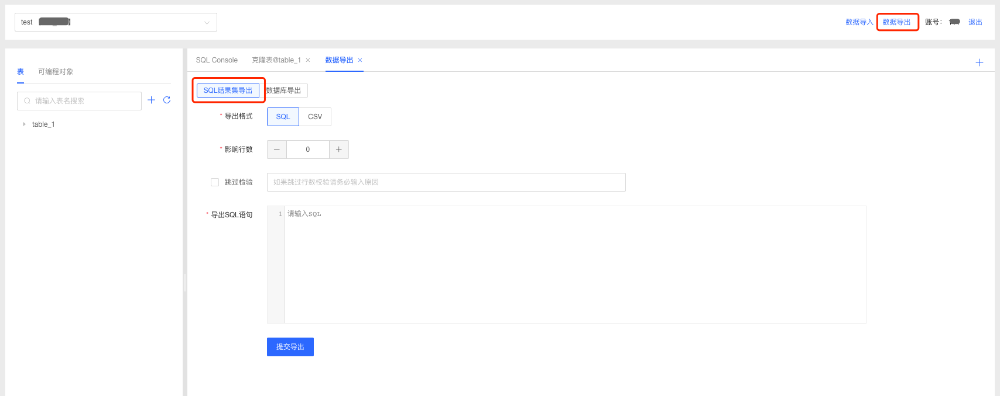
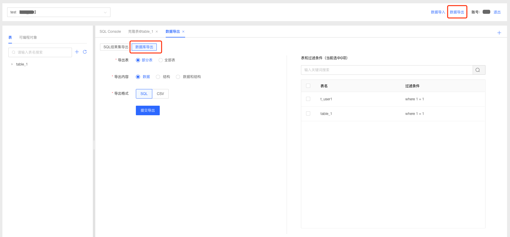

# 数据导出
### SQL结果集导出

1. 选择要导出数据的数据库；
2. 点击右侧顶部【数据导出】按钮，进入数据导出页面，选择”SQL结果集导出“；
3. 选择导出模式，填写影响行数，根据实际情况选择是否跳过校验，输入导出SQL语句， 多条SQL语句用英文分号隔开；
4. 点击提交导出按钮数据库执行导出任务；

### 数据库导出

1. 选择要导出数据的数据库；

2. 点击右侧顶部【数据导出】按钮，进入数据导出页面，选择”数据库导出“；

3. 根据需求选择导出表、导出内容等信息，点击提交导出按钮数据库执行导出任务；

   | 配置项   | 说明                                                         |
   | -------- | ------------------------------------------------------------ |
   | 导出的表 | 选择导出部分表或全部表。若选择部分表，您需要在页面右侧选中表并配置过滤条件。 |
   | 导出内容 | 根据业务需求选择数据、结构或数据和结构。                     |
   | 导出格式 | 当导出内容为数据时，导出格式可选项为SQL、CSV；当导出内容为结构或数据和结构时，导出格式可选项为SQL文本。 |

