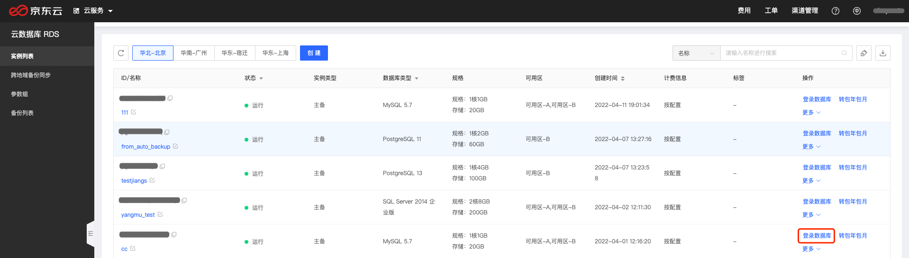
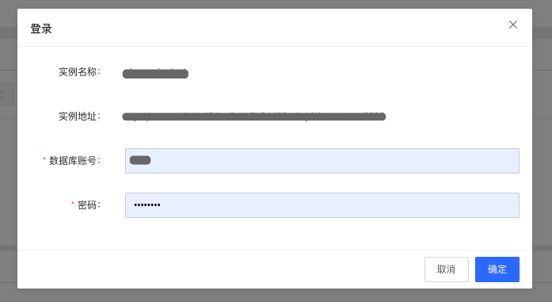
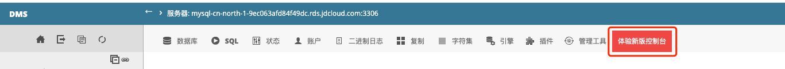

# 登录数据库 

1. 云数据库MySQL通过控制台-云数据库RDS登陆DMS，先登陆京东云控制台，打开云数据库RDS页面；

2. 找到要管理的数据库实例，点击【登陆数据库】按钮，打开DMS登陆页面；

   

3. 登陆页面会自动带出实例名称和地址信息，输入当前数据库账号和密码后，点击确认可以登录实例；

   

4. 说明：目前登陆数据库会先进入旧版DMS系统，点击【体验新版控制台】可进入新版本DMS系统

   

