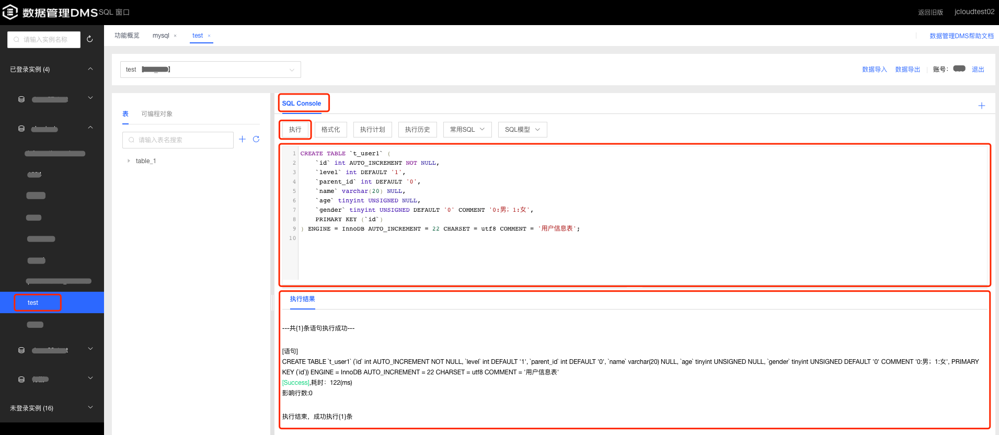
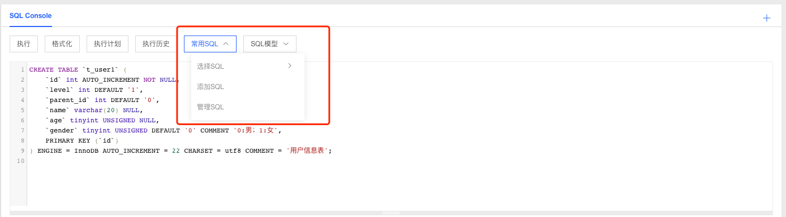
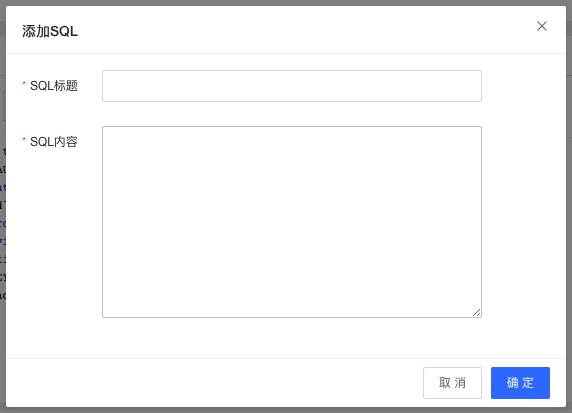
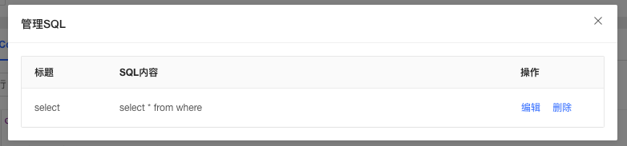
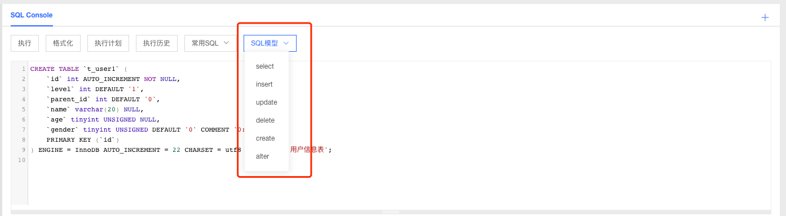
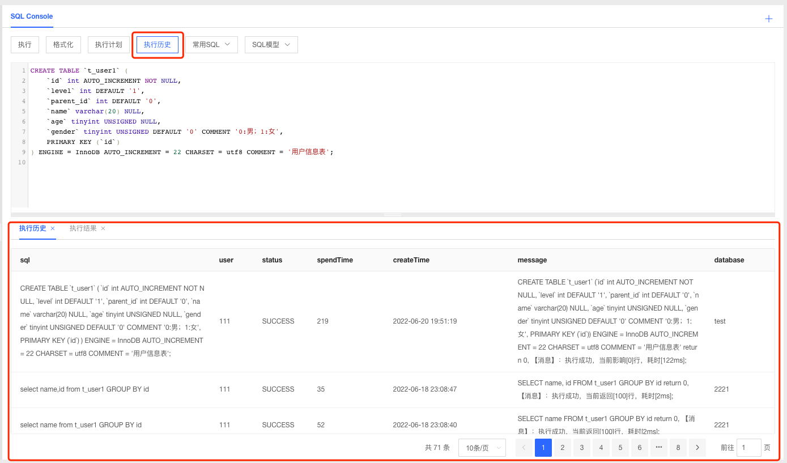
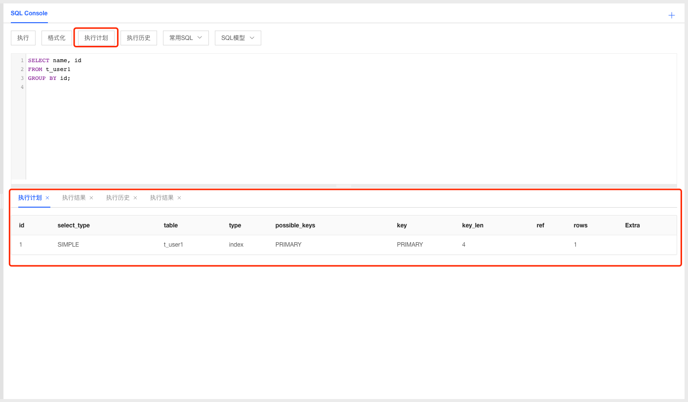

# SQL查询
SQL窗口可以非常便捷的执行各种SQL语句，同时支持查询SQL执行计划、SQL历史以及设置常用SQL等功能；SQL窗口目前支持单库查询，用户可根据需要添加多个查询窗口。

### SQL 执行窗口

1. 选择要查询的数据库，在SQL Console中输入要执行的SQL；
2. 可通过【格式化】功能自动格式化SQL信息；
3. 点击【执行】提交系统执行SQL，结果可在执行结果中进行查看；

### 常用SQL

1. 点击常用SQL，支持用户添加、管理、选择使用常用SQL；

   

2. 添加SQL：输入SQL标题和SQL内容添加常用SQL；

   

3. 管理SQL：可对已添加的SQL进行编辑和删除等管理操作；

   

4. 选择SQL：点击已添加的SQL后系统自动填充SQL至SQL窗口，可根据需要进行SQL的编辑和执行；

5. 系统也预置了常用的SQL模型，支持用户快速选择使用；

   

### 查看SQL历史

1. 点击【执行历史】可查看执行的历史数据；

   

### 查看执行计划

1. 针对SELECT语句，系统支持查看SQL执行计划，可根据计划优化SQL语句；

   

