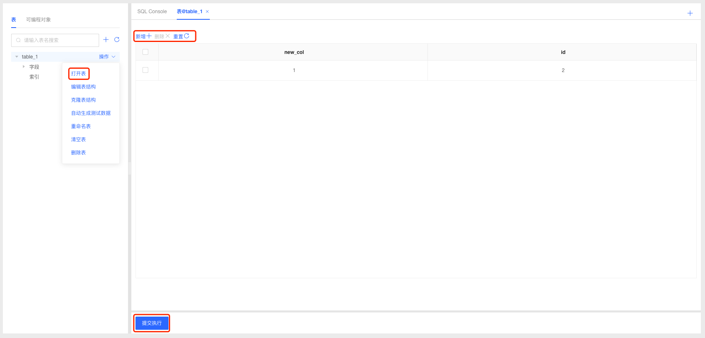
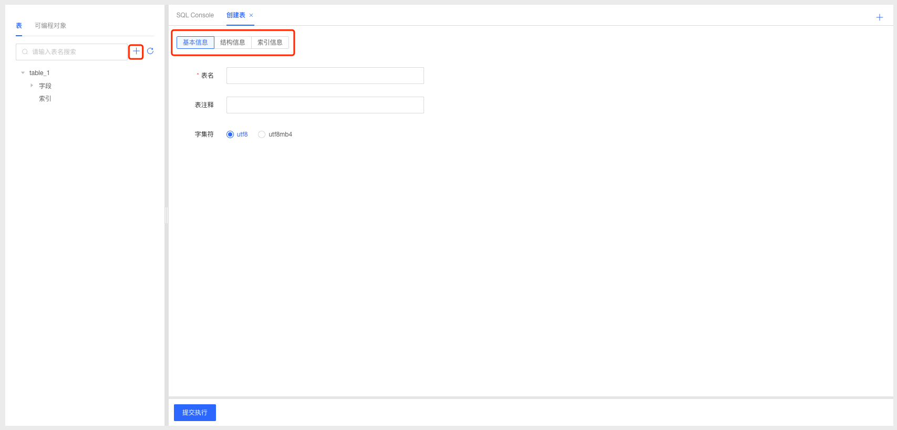
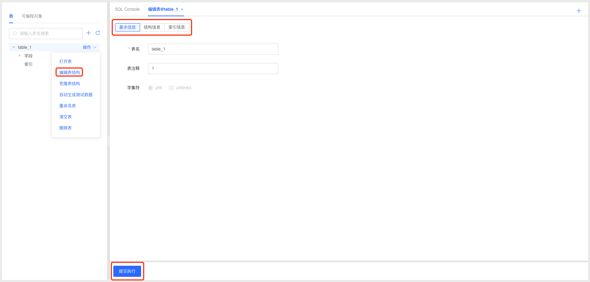
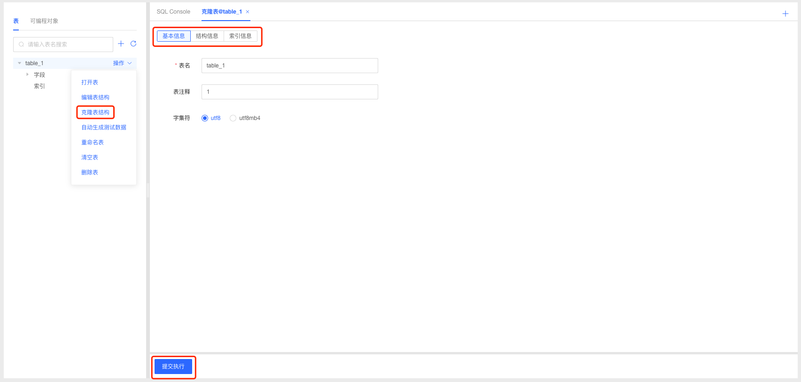
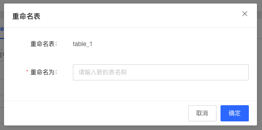

# 表管理
提供表的新建、删除、结构修改、重命名以及表数据维护、清空等操作；支持克隆表结构以及索引信息；支持按照当前表结构自动生成测试数据，自动化构建测试数据能力。

### 打开表

1. 选择要打开的表，点击操作按钮选择”打开表“，进入表详情页面，可查看表字段以及数据信息；
2. 页面中支持新增和删除数据，操作修改后，点击提交按钮提交数据库执行；

### 新建表

1. 点击表Tab下的新增“+”按钮，进入创建表页面；
2. 用户根据需要编辑基本信息、结构信息、索引信息后，点击”提交执行“按钮提交数据库执行创建表操作；
3. 表创建成功后，系统自动刷新页面，可在表Tab下查看新建的表信息；

### 编辑表结构

1. 选择要修改结构的表，点击操作按钮选择”编辑表结构“，进入表结构编辑页面；
2. 用户根据需要修改基本信息、结构信息、索引信息后，点击”提交执行“按钮提交数据库执行修改操作；

### 克隆表结构

1. 选择要克隆的表，点击操作按钮选择”克隆表结构“，进入克隆表结构页面；
2. 系统自动克隆表结构信息、结构信息、索引信息，用户根据需要进行信息调整，点击”提交执行“按钮提交数据库执行创建表操作；
3. 表创建成功后，系统自动刷新页面，可在表Tab下查看新建的表信息；

### 自动生成测试数据

1. 选择要操作的表，点击操作按钮选择”自动生成测试数据“，系统自动生成测试数据；

### 重命名表

1. 选择要操作的表，点击操作按钮选择”重命名表“，在弹窗中输入新的表名称，点击”确定“数据库执行修改表名称；

   

### 清空变

1. 选择要操作的表，点击操作按钮选择”清空表“，弹窗确认信息后，点击”确定“数据库执行清空操作；

### 删除表

1. 选择要操作的表，点击操作按钮选择”删除表“，弹窗确认信息后，点击”确定“数据库执行删除操作；
