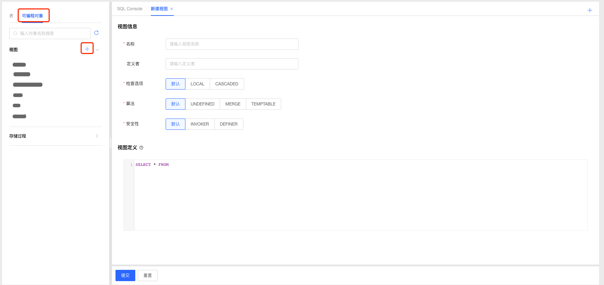
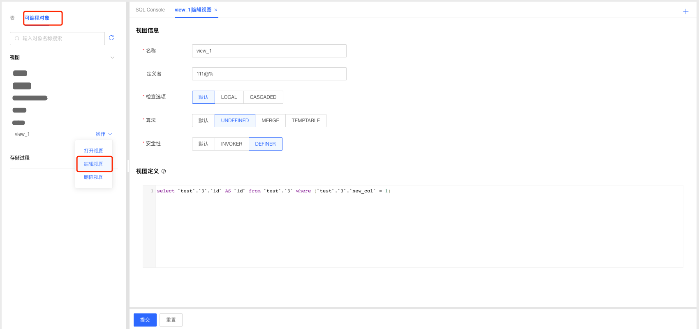
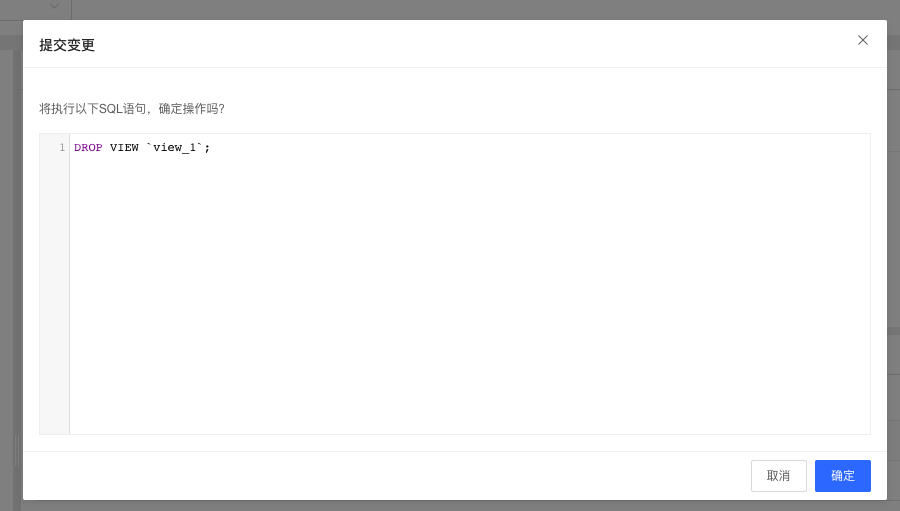
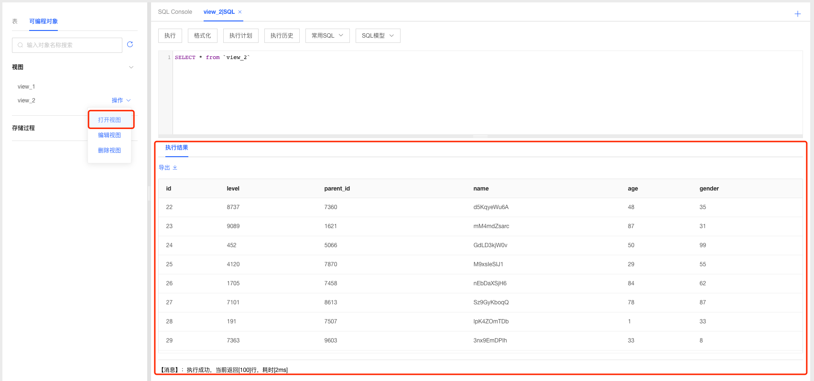

# 视图管理

DMS支持MySQL数据库管理视图，开发人员可根据业务场景选择使用视图功能。

### 新建视图

1. 选择要创建视图的数据库，选择可编程对象Tab页，点击视图标签可查看当前数据库中已创建的视图；

2. 点击视图标签后的添加按钮，打开视图定义窗口；

   

3. 根据需要填写视图名称以及选择相关参数，填写视图定义信息；

4. 填写完成后点击提交按钮，系统根据用户填写的相关数据生成创建视图的SQL语句，确认无误后点击确认按钮提交系统创建视图；

   

5. 创建完成后系统自动刷新页面，可在视图标签下查看新创建的视图；

### 编辑视图

1. 选择要编辑的视图，点击操作选择【编辑视图】，进入编辑视图页面；
2. 根据需要调整视图参数和定义，填写完成后点击提交按钮，系统根据用户填写的相关数据生成创建视图的SQL语句，确认无误后点击确认按钮提交系统更新视图；
3. 视图编辑更新成功后，系统自动刷新页面，可在视图标签下查看编辑后的视图；

### 删除视图

1. 选择要删除的视图，点击操作选择【删除视图】，进入删除视图确认弹窗，点击确认后即可删除视图；

   

### 打开视图

1. 选择要打开的视图，点击操作选择【打开视图】，进入SQL窗口执行打开视图操作，即可查看视图内容；

   

