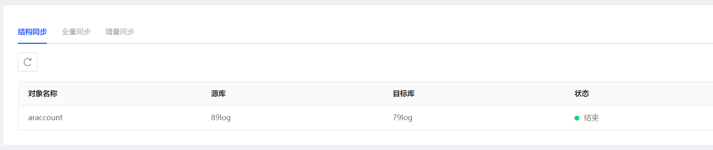
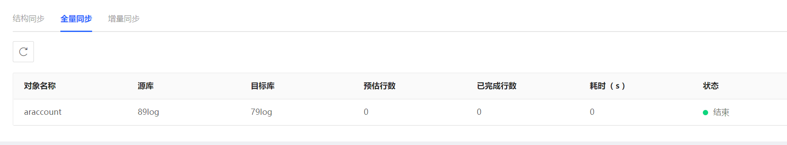

# 查看任务进度
在数据传输服务进行的过程中，可通过控制台查看结构同步和全量同步的任务执行情况。

## 操作步骤
1. 登录[数据传输服务控制台](https://dts-console-new.jdcloud.com/syncList)。
2. 根据需要查看的任务类型，在左侧菜单栏选择 **数据同步**或**数据迁移**，本次以数据同步为例。
3. 点击需要查看进度的目标实例ID，进入任务详情页面。
4. 根据需要查看的任务步骤选择下述操作步骤。
   * 查看结构同步
     * 上方选择**进度详情->结构同步**
     * 查看对应的任务列表及状态。
     
  

   * 查看全量同步
     * 上方选择**进度详情->全量同步**
     * 查看对应的任务列表及状态。
     
 
 
   * 查看增量同步
     * 上方选择**进度详情->增量同步**
     * 查看对应的任务列表及状态。

 
