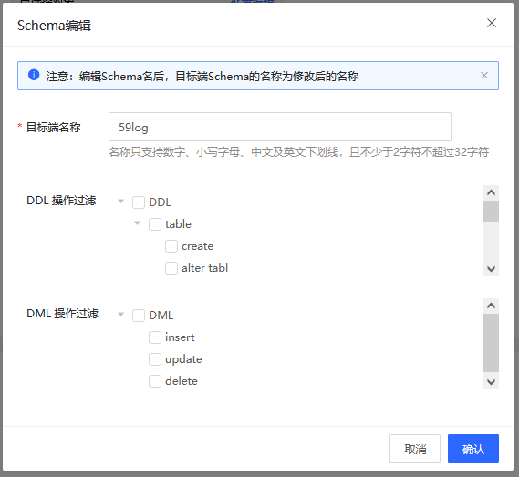
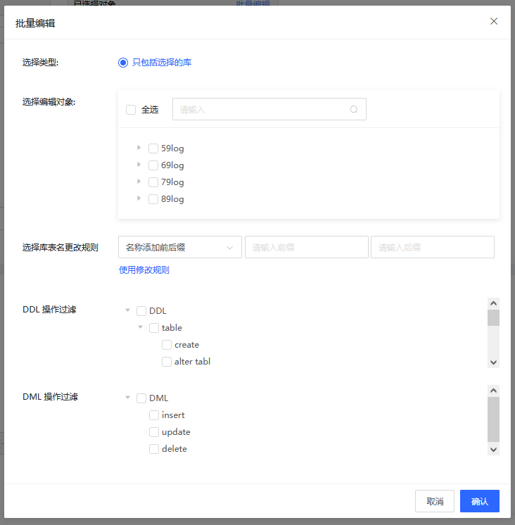

# 数据库库名表名映射

配置DTS任务时，支持对需同步的库进行库表名映射。通过此功能可以修改目标库中的名称。

## 使用场景

在配置任务的第二步配置任务对象和内容中，设置任务对象在目标库的名称时可以建立源库的A表同步到目标库时映射为目标库的B表。

## 前提条件

* 创建了一个DTS任务并没有进行任务的配置。

## 库名单个映射

1. 在配置任务对象和内容步骤中，将需要迁移或同步的任务移动到目标列表。

2. 鼠标移动到选择修改的库表名或表名上，点击**编辑**图标。

3. 在弹窗中修改对象在目标端的名称。

   * 库名映射

     在编辑库对话框中，设置该数据库在目标实例中的名称。

     
     
     

 * 表名映射

     在编辑表对话框中，设置该数据表在目标实例中的名称。

      

4. 点击**确定**，完成库表名的映射配置。

5. 根据任务步骤完成后续任务配置。

## 批量库表名映射

1. 在配置任务对象和内容步骤中，将需要迁移或同步的任务移动到目标列表。

2. 点击目标列上方的**批量编辑**按钮，进入批量编辑弹窗。

3. 根据批量编辑的数据库实际需求有选择的进行库表名的设置。

   1) 选择需要批量编辑的类型，本次配置中选择**选择所有的库和表**

   2) 选择需要编辑的对象：勾选需要修改库表名的对象

   3) 给库和表添加前后缀名称，配置完成后点击**增加修改规则**

     

4. 点击**确定**，完成批量库表名的映射配置。

5. 根据任务步骤完成后续任务配置。