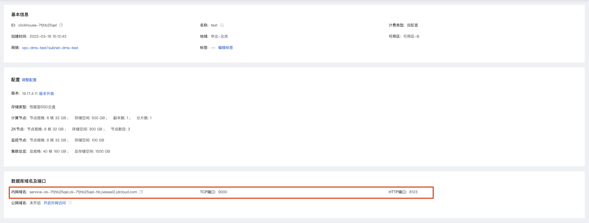

# 连接实例

 分析型云数据库ClickHouse支持通过命令行工具或其他客户端（DataGrip、DBeaver）连接ClickHouse实例。

## 前提条件

已完成快速入门的如下步骤：

[新建实例](https://docs.jdcloud.com/cn/jchdb/create-instance1)

[创建账号](https://docs.jdcloud.com/cn/jchdb/create-account1)

[设置白名单](https://docs.jdcloud.com/cn/jchdb/setwhitelist)

## 操作步骤

1. 在实例列表页，点击要连接的实例名称，进入实例详情页
2. 在实例详情页面中，查看实例的域名及端口信息。分析型云数据库ClickHouse集群有两个端口，TCP端口和HTTP端口，可按需使用。



3.  连接实例

   #### 客户端连接

   1. 实例所在VPC内选择一台云主机，在该云主机内，安装下载客户端 [点击下载clickhouse-client](https://repo.yandex.ru/clickhouse/rpm/stable/x86_64/)。

   2. 安装客户端

   ```
   rpm -ivh *.rpm
   ```

   3. 通过 clickhouse-client客户端 访问该实例

  - 节点 IP 地址可以通过控制台查看，tcp 服务端口选择9000。

   ```
   clickhouse-client -hxxx.xxx.xxx.xxx --port 9000
   ```

  - http 端口选择8123。确认&查询集群上的引擎版本 。

   ```
   echo "select version()=21.8.15.4"  |  curl  'http://xxx.xxx.xxx.xxx:8123/' --data-binary @-
   ```

   ```
   echo "select version()"  |  curl  'http://xxx.xxx.xxx.xxx:8123/' --data-binary @-
   ```
  - 查询系统cluster   
    
   ```
   echo "select * from system.clusters"  |  curl 'http://xxx.xxx.xxx.xxx:8123/' --data-binary @-
   ```

####        命令行连接

​         登录到与该实例在同一VPC中的云主机，在clickhouse-client客户端的安装目录下执行如下命令。

```
./clickhouse-client --host=<host> --port=<port> --user=<user> --password=<password>
```

- 参数说明：

  | 参数     | 说明                                                         |
  | -------- | :----------------------------------------------------------- |
  | host     | 外网地址或VPC地址。如果clickhouse-client所在服务器与云数据库ClickHouse集群在同一VPC内，您可以使用VPC地址。否则，请使用外网地址。 |
  | port     | TCP端口号。                                                  |
  | user     | 您通过分析型云数据库ClickHouse控制台创建的数据库账号。       |
  | password | 数据库账号对应的密码。                                       |
