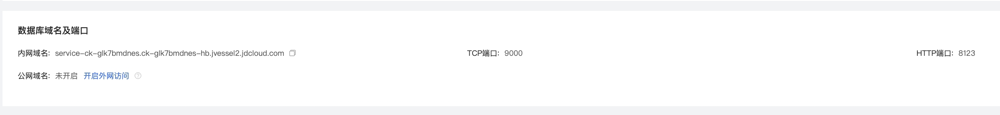
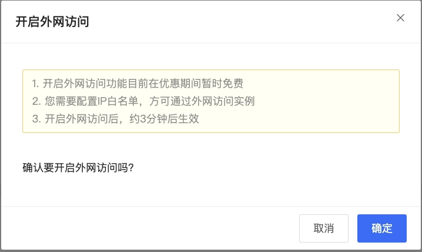

# 外网访问

分析型云数据库ClickHouse支持内网地址和外网地址两种地址类型，默认提供内网地址供用户进行内部访问ClickHouse实例。如有外网访问需求可在实例详情页中进行外网地址申请。

## 注意事项

* 申请外网域名以及数据外网传输产生的公网流量暂不收费
* 通过外网域名访问会降低实例安全性，请谨慎使用，如需使用请同时做好白名单设置。
* 外网访问关闭后在开启，访问地址不变

## 操作步骤

### 开启外网访问
1. 登录[分析型云数据库ClickHouse 管理控制台](https://jchdb-console.jdcloud.com)。

2. 在实例列表页， 选择需要开启外网的目标实例，进入到目标实例详情页。

3. 选择 **数据库域名及端口 **标签，点击 **开启外网访问** 按钮，会出现一个二次确认弹窗。

4. 在二次确认弹窗中，点击确定 按钮。
  

5. 外网访问开启后，系统会自动分配一个外网地址地址。

   
### 关闭外网访问

1. 登录[分析型云数据库ClickHouse 管理控制台](https://jchdb-console.jdcloud.com)。
2. 在实例列表页， 选择需要关闭外网的目标实例，进入到目标实例详情页。
3. 选择 **数据库域名及端口 **标签，点击 **关闭外网访问** 按钮。

4. 在确认弹窗中，点击 **确定** 按钮，系统会关闭外网访问。