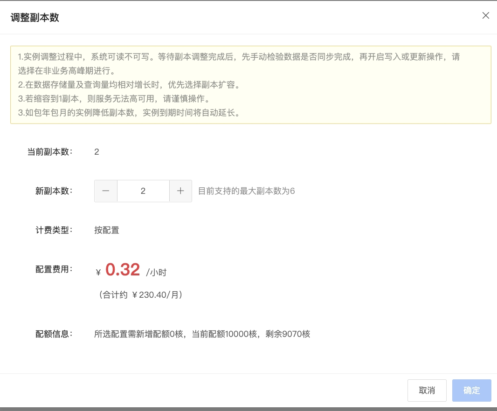

# 变更副本

在使用分析型云数据库ClickHouse过程中，当数据存储量及查询量均相对增长时，可优先选择副本扩容。变更副本功能可以通过分析型云数据库ClickHouse管理控制台设置。 

## 操作步骤

1. 登录[分析型云数据库ClickHouse 管理控制台](https://jchdb-console.jdcloud.com)。
2. 选择需要修改配置的目标实例，点击目标实例，进入实例详情页。
3. 点击 ***调整副本数 *** ，弹出框参数说明如下:
   * 当前副本数：实例当前副本数
   * 新副本数：扩/缩容后副本数

