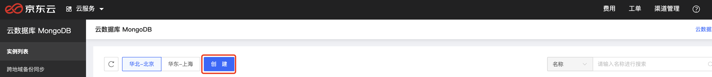

# 创建分片集群

您可以通过MongoDB控制台或OpenAPI快速创建MongoDB实例，关于实例的计费说明请参见。

## 前提条件

- 已注册京东云账号，并完成实名认证。如果您未满足此条件请先注册账号请注册或实名验证。

- 如计费类型选择按配置计费，请确认您的账户余额（包括代金券）不小于50元。

## 操作步骤及相应说明

1. 请登录[MongoDB控制台](https://mongodb-console.jdcloud.com/mongodb)，并在控制台界面找到**创建**按钮，点击即可进入创建页面；

   

   

2. 在规格中选中**分片集群**并配置其他可选项；

3. 点击立即购买，确认订单后即可完成实例的创建；

4. 在实例创建页面，您将有诸多可选项，具体参数说明和使用限制参照如下：

| 参数             | 参数说明                                                     | 使用限制                                                     |
| ---------------- | ------------------------------------------------------------ | ------------------------------------------------------------ |
| 计费类型         | 仅支持包年包月和按配置付费两种付费模式，关于付费模式的介绍请参见付费概述文档。 |                                                              |
| 地域             | 选择实例所在的地域，可根据您的业务部署和连接时延进行相应选择。 | 实例创建后无法修改地域若您想与京东云云主机进行通信，请保证您的云主机实例与MongoDB实例处于同一地域内 |
| 数据库版本       | 所部署的数据库环境版本，目前可选版本为3.4、3.6和4.0，请您根据具体业务需求进行数据库版本的选择。 |                                                              |
| 存储类型         | 提供SSD本地盘和SSD云盘两种存储方式，您可根据具体需要选择使用。 |                                                              |
| mongos           | mongos规格：代表mongos所占用的CPU和内存不同规格有不同的最大连接数以及IOPS，规格越高可拥有更高的IOPS和最大连接数，具体规格信息请参照产品规格 |                                                              |
|                  | mongo存储空间：各个节点所占用的存储空间大小                  |                                                              |
|                  | mongos节点数：mongos节点的数量，为满足不同用户的高可用需求，京东云支持运行2-12个Mongos节点 |                                                              |
| configserver     | configserver默认使用三节点的副本集进行集群搭建。             | 京东云不支持configserver的修改，默认采用1C2G的小规格，且不可修改存储空间。 |
| shard            | shard规格：代表shard所占用的CPU和内存不同规格有不同的最大连接数以及IOPS，规格越高可拥有更高的IOPS和最大连接数，具体规格信息请参照产品规格。 |                                                              |
|                  | shard存储空间：各个节点所占用的存储空间大小                  |                                                              |
|                  | shard节点数：京东云MongoDB数据库允许使用2-32个shard节点搭建您的分片集群，每个shard均以3节点副本集进行搭建，且不支持Secondary节点的水平扩容。 |                                                              |
| 选择网络         | 仅支持选择私有网络，若您未建设自己的私有网络或私有网络子网已满，您可点击新建私有网络或新建子网进行网络的配置 |                                                              |
| 部署方式         | 分片集群同样支持单/多可用区部署方式，单可用区部署将所有数据库实例放置在同一可用区。当选择多可用区部署时，默认主、从、隐藏节点各部署于不同的可用区，且shard数量超过3时，其会按照固定顺序依次循环部署在三个可用区。多可用区部署时，mongos同时会随顺序依次部署。 |                                                              |
| 密码（可选）     | 对您的实例设置登录密码，京东云MongoDB实例默认账号未admin，同时您可在实例创建后再设置登录密码。 |                                                              |
| 购买时长（可选） | 当您选择包年包月付费方式时，你可以选择不同时长的实例购买时间，当您选择按配置续费时则无此选项 |                                                              |
| 自动续费（可选） | 当保障您的账户余额充足时，开启包年包月可自动续费，避免因错过续费时间导致实例自动关闭 |                                                              |

## 相关API接口

<<<<<<< HEAD
| 接口名称                                                     | 功能描述         |
| ------------------------------------------------------------ | ---------------- |
| [createShardingInstance](../../../../../API/JCS-for-MongoDB/Instance-Management/createShardingInstance.md) | 创建分片集群实例 |
=======
| 接口名称                                                     | 功能描述         |      |
| ------------------------------------------------------------ | ---------------- | ---- |
| [createShardingInstance](../../../../../API/JCS-for-MongoDB/Instance-Management/createShardingInstance.md) | 创建分片集群实例 |      |
>>>>>>> 4c3dc9871aaf2a83ee90cafb4e172eb35b893a9b
