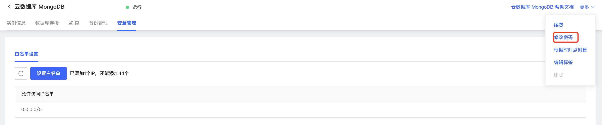

# 修改密码

出于安全考虑，京东云MongoDB用户需对实例设置登录密码后才可连接访问数据库。京东云MongoDB数据库支持对实例登录密码进行修改，如果您创建时未设置密码、忘记实例密码、修改实例密码，您可以通过京东云MongoDB数据库提供的修改密码功能重新设置密码。

## 前提条件

- MongoDB实例处于运行中状态，且计费状态正常

## 操作步骤

1. 登陆[MongoDB控制台](https://mongodb-console.jdcloud.com/mongodb)；

2. 在实例列表中查找需要修改/设置密码的实例；

3. 点击实例名称进入**实例详情**页；

4. 点击页面右上角的更多；

   

5. 在下拉菜单中点击修改密码，弹窗中的字段说明如下：

   | 字段名称 | 字段说明                           | 使用限制                                                     |
   | -------- | ---------------------------------- | ------------------------------------------------------------ |
   | 实例名称 | 除实例ID外，用户可自行修改的实例名 | 不支持在修改密码时修改实例名称，需要进入在实例详情页面进行修改 |
   | 新密码   | 用户自行修改/设置的实例登陆密码    | 密码必须包含且只支持大小写字母及数字，不少于8字符不超过16字符。 请不要填写与您当前root账户密码相同的密码。 |
   | 确认密码 | 对新修改/设置的密码的校验          |                                                              |

6. 点击确定，完成密码修改/设置。

## 相关API

| 接口                                                         | 接口描述 |
| ------------------------------------------------------------ | -------- |
| [resetPassword](../../../../API/JCS-for-MongoDB/Instance-Management/resetPassword.md) | 重置密码 |

