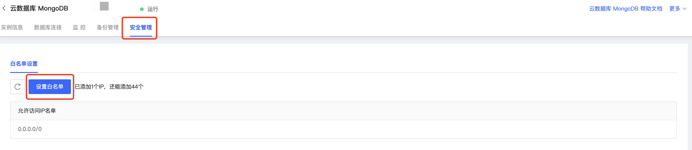

# 设置白名单

云数据库MongoDB支持设置白名单功能，您可以通过白名单精确控制访问源。

MongoDB实例创建完成后，默认会将当前实例所在VPC的CIDR加入到白名单，即对当前VPC内的IP无限制。此外，如果当前实例所在VOC支持IPv6，则默认仅添加IPv6 CIDR。

## 前提条件

- 已经购买京东云MongoDB数据库并且实例已处于运行中状态。

## 操作步骤

1. 登录[MongoDB控制台](https://mongodb-console.jdcloud.com/mongodb)；

2. 在**实例列表**页面选择目标实例，点击实例名称可进入**实例详情**页面；

3. 在实例详情页面上方导航栏中点击**安全管理**；

   

4. 进入安全管理页面点击设置白名单，弹窗字段说明和规则如下：

| 功能             | 功能描述                                                     | 限制条件                     |
| ---------------- | ------------------------------------------------------------ | ---------------------------- |
| 手动添加白名单   | 支持添加单个IP地址支持以0.0.0.0/0（IPv4）、::/0（IPv6）代表允许所有IP访问支持以CIDR模式设置白名单支持一次键入多个IP地址/CIDR，不同IP间使用,分隔 | 最多支持45个白名单IP或者IP段 |
| 加载云主机内网IP | 支持将同一账号、同一VPC下的云主机IP加入白名单若云主机IP地址为IPv6地址，则仅添加IPv6地址进白名单 |                              |

## 相关API

| 接口名称                                                     | 接口描述           |
| ------------------------------------------------------------ | ------------------ |
| [describeSecurityIps](../../../../API/JCS-for-MongoDB/Security-Management/describeSecurityIps.md) | 查询实例访问白名单 |
| [modifySecurityIps](../../../../API/JCS-for-MongoDB/Security-Management/modifySecurityIps.md) | 修改实例访问       |