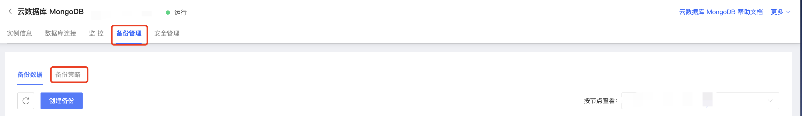

# 自动备份

京东云MongoDB可以通过控制台设置实例自动备份时间，以实现您的容灾需求。本文将介绍自动备份的介绍MongoDB控制台自动备份的规则设置和备份管理。

## 注意事项

- 自动备份文件不支持删除。

- 若当天已执行自动备份，修改自动备份时间在当前时间之后，仍会创建备份。

- 自动备份默认时间为每天的0:00-1:00，您需要针对自己业务灵活调整自动备份任务执行时间。

- 自动备份任务所创建的备份文件为数据库实例的物理备份。

## 操作步骤

1. 登录[MongoDB控制台](https://mongodb-console.jdcloud.com/mongodb)；

2. 在**实例列表**页面筛选目标实例，点击实例名称进入**实例详情**页面；

3. 在实例详情页面上方标签中选中**备份管理**进入相应界面；

4. 默认为备份管理页面，此页面可详细查看本实例所有备份；

   

   字段说明如下：

   | 字段名称           | 字段说明                              |
   | ------------------ | ------------------------------------- |
   | 备份ID             | 数据库备份的唯一识别ID                |
   | 节点ID（分片集群） | 不同Shard节点的数据库备份             |
   | 备份开始/结束时间  | 自动/手动备份任务的开始和结束时间标识 |
   | 备份状态           | 备份任务是否在进行中的标识            |
   | 大小               | 数据库备份大小                        |
   | 备份类型           | 自动或手动备份的区别标识              |
   | 备份方式           | 逻辑或物理备份的区别标识              |

5. 若需要设置自动备份的策略，点击上方标签栏中的**备份策略**，备份策略页面字段说明如下：

   | 字段名称     | 字段说明                                         |
   | ------------ | ------------------------------------------------ |
   | 自动备份周期 | 自动备份任务执行周期，默认为每天一次且不支持更改 |
   | 自动备份时间 | 任务执行的时间点                                 |
   | 保留天数     | 自动备份数据的保留时长，默认为7天且不支持更改    |

6. 点击**修改策略**即可修改每天自动备份任务执行时间。