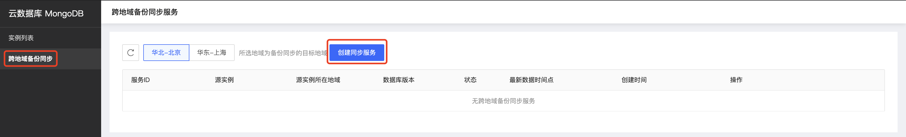

# 跨地域备份同步

跨地域备份同步服务是京东云提供的跨地域数据同步方案，该服务可将实例的全量备份与增量备份同步到您指定的地域，并支持基于备份数据快速创建新的数据库实例。通过该服务，您可以轻松实现数据异地灾备。

本文介绍如何通过控制台创建地域备份同步服务。

## 注意事项

- 一个实例仅可创建一个跨地域备份同步服务。

- 目标地域的备份数据保留7天，您可以选择7天内的数据时间点创建新实例。

- 如果源实例删除，则其对应的跨地域备份同步服务一并删除。

- 跨地域备份同步不可将备份存储至本地域，若进行本地域数据备份请参考手动备份。

- 跨地域备份同步服务删除后，目标地域同步的备份也将会删除。

## 前提条件

- 实例状态为运行，且计费状态正常。

## 操作步骤

1. 登录[MongoDB控制台](https://mongodb-console.jdcloud.com/mongodb)；

2. 点击页面左侧**跨地域备份同步**，进入相应页面，点击**创建同步服务**按钮，打开创建弹窗；

   

   具体字段说明如下：

   | 字段名称       | 字段说明                                       |
   | -------------- | ---------------------------------------------- |
   | 源实例所在地域 | 需要执行备份任务的实例所在地域                 |
   | 源实例         | 需要执行备份任务的实例                         |
   | 目标地域       | 数据库备份任务执行完毕后，备份文件所存储的地域 |

3. 确认备份任务信息无误后点击确定即可执行备份任务，并在**目标地域备份列表**中可查看任务进行状态和备份文件。