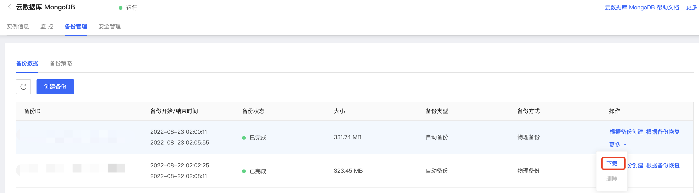

# 下载备份

京东云MongoDB实例的备份文件支持下载，您可以根据需要自行下载备份文件

## 使用说明

- 内网地址和外网下载地址有效期为24小时；

- 使用wget下载时需要对URL添加英文引号；

- 若云主机与云数据库在同一地域，建议采用内网地址下载。

## 操作步骤

1. 登录[MongoDB控制台](https://mongodb-console.jdcloud.com/mongodb)；
2. 在**实例列表**页面筛选目标实例，点击实例名称进入**实例详情**页面；
3. 点击实例详情页上方的**备份管理**；
4. 在备份列表中选择需要下载的备份，在**操作**列中点击下载。

