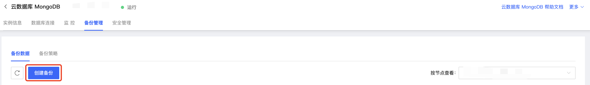

# 手动备份

当您需要实时对MongoDB实例进行备份时，您可以通过京东云MongoDB控制台的手动备份功能生成指定实例的备份文件。

## 注意事项

- 手动备份最多存储三个文件，如当前已有3个手动备份，再次创建手动备份时会按时间顺序删除最早的一个手动备份。

- 若此实例已有进行中的备份任务，此时不可再次发起其他实例备份任务。

## 操作步骤

1. 打开[MongoDB控制台](https://mongodb-console.jdcloud.com/mongodb)；

2. 在**实例列表**页面筛选目标实例，点击实例名称，进入**实例详情**页；

3. 在**实例详情**页，点击上方标签中的**备份管理**，进入备份管理页面；

4. 点击**创建备份**，弹出创建备份方式弹窗后选择需要备份的方式，可自由选择进行逻辑备份或物理备份；

   

   

5. 点击确定即可开始执行手动备份任务。