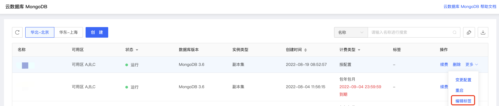

# 配置实例标签

当您需要标识单个或多个特殊实例时，您可以通过设置标签的操作方便后续查找和管理。

## 注意事项

- 标签由一个键值对组成，且各不可为空；

- 添加标签时，默认标签组为空，当用户添加一个标签时，可形成一个历史记录，可供后续实例添加标签使用；

- 当某个标签不再挂载在任何一个实例时，此标签则直接删除；

- 一个标签可挂在任意实例上，每个实例最多可绑定10个标签；

- 当新建一个键值时，请在下拉列表中选中，否则会导致键值对内容错误；

## 操作步骤

1. 登录[MongoDB控制台](https://mongodb-console.jdcloud.com/mongodb)；

2. 在实例列表页筛选目标实例，在操作列点击更多，下拉菜单中点击编辑标签；

   

3. 在添加标签的弹窗内选择标签；

   若需要新建标签，在下拉框内输入自定义键值对，然后需要在下拉列表选中标签键值。

   若使用已存在标签，则在下拉框内选择相应标签或手动输入标签。

4. 确认无误后点击确定，即可给实例添加标签。