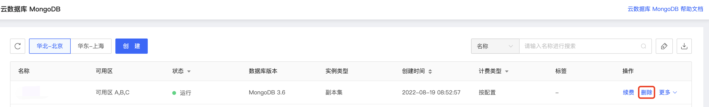

# 删除实例

当您不再使用某个京东云MongoDB实例时，您可以删除该实例以节约成本。京东云MongoDB控制台可通过两条路径对闲置实例进行删除操作

## 注意事项

- 计费类型为按配置的实例可随时删除。

- 计费类型为包年包月的实例，不支持未到期删除，删除按钮无法进行交互。

- 实例删除后不可恢复，请谨慎操作。

- 实例删除后，该实例的备份数据会一并删除且不可恢复，您可先对数据库进行备份，通过下载备份保留实例运行期间所产生的数据。

## 操作步骤

1. 登录[MongoDB控制台](https://mongodb-console.jdcloud.com/mongodb)；
2. 在**实例列表**通过快速筛选等功能定位目标实例；
3. 在**操作**列中点击**删除**，弹出删除提示弹窗，点击确定即可删除。

## 相关API

| 接口名称                                                     | 接口功能         |
| ------------------------------------------------------------ | ---------------- |
| [deleteInstance](../../../../../API/JCS-for-MongoDB/Instance-Management/deleteInstance.md) | 删除实例         |
| [createBackup](../../../../../API/JCS-for-MongoDB/Backup-Management/createBackup.md) | 创建备份         |
| [describeBackups](../../../../../API/JCS-for-MongoDB/Backup-Management/describeBackups.md) | 查看备份         |
| [backupDownloadURL](../../../../../API/JCS-for-MongoDB/Backup-Management/backupDownloadURL.md) | 获取备份下载链接 |
| [deleteBackup](../../../../../API/JCS-for-MongoDB/Backup-Management/deleteBackup.md) | 删除备份         |