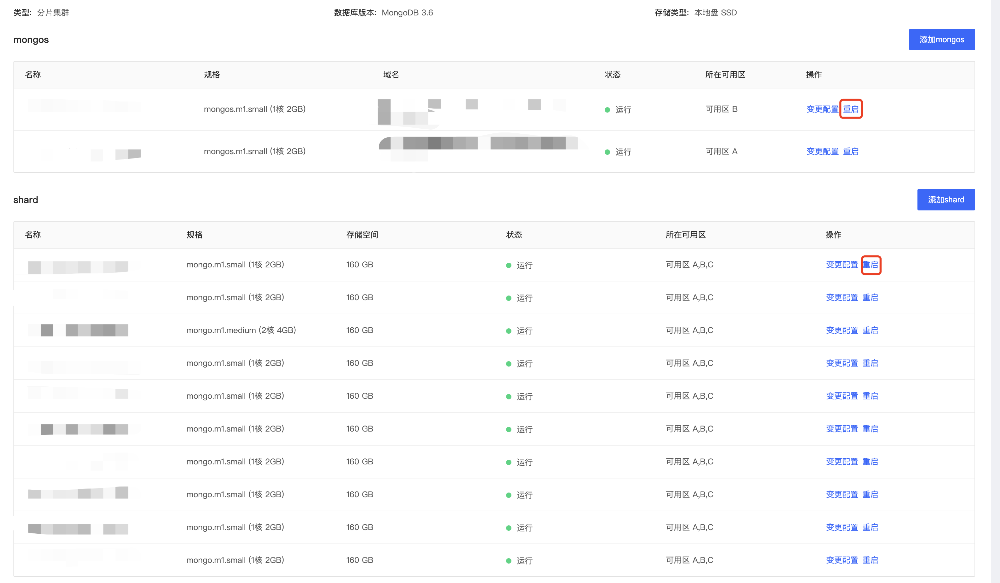

# 重启分片集群节点

若实例出现性能问题或连接数长期打满的情况，需要重启实例进行问题排查时，您可以通过京东云控制台实现重启实例功能。

MongoDB副本集与分片集群由于架构不同，其重启机制也有所不同，本文将分别介绍分片集群的实例重启功能。

## 注意事项

- 当重启实例时，实例连接将中断；

- 重启实例可能导致主从切换，请重启后确认MongoDB连接正常；

- 外网域名有可能因重启导致更改，请及时校验连接域名；

- 分片集群不支持实例级别重启，仅支持节点级别的重启；

- 分片集群中的Config Server节点默认不可重启。

## 操作步骤

1. 登录[MongoDB控制台](https://mongodb-console.jdcloud.com/mongodb)；
2. 在**实例列表**通过快速筛选功能定位目标实例；
3. 点击实例名称进入**实例详情**页；
4. **下滑实例信息页**，进入配置信息模块；
5. 定位需要重启的节点，点击**操作**列中的**重启**按钮，弹出重启确认框点击确定。

## 相关API

| 接口名称    | 接口说明                                       |
| ----------- | ---------------------------------------------- |
| restartNode | 重启MongoDB分片集群节点，支持重启Mongos、Shard |