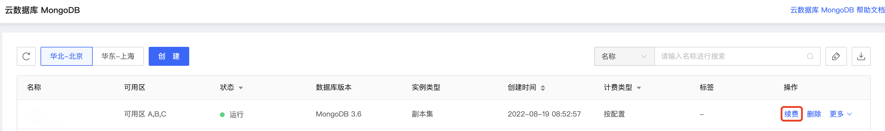

# 续费实例

通过京东云控制台，您可以对当前运行的实例续费，请在实例到期或欠费后7天内缴费，否则实例将被删除。

## 注意事项

- 续费仅针对包年包月配置。

## 操作步骤

1. 登录[MongoDB控制台](https://mongodb-console.jdcloud.com/mongodb)；

2. 进入**实例列表**页面，通过快速筛选选择目标实例，在**操作**列中点击续费，打开缴费页面；

   

3. 在缴费页面选择您需要续费的时长；

4. 确认无误，点击去支付，完成支付流程；

5. 续费完成后，您可以在实例列表页或实例详情页查看该实例的最新到期时间。