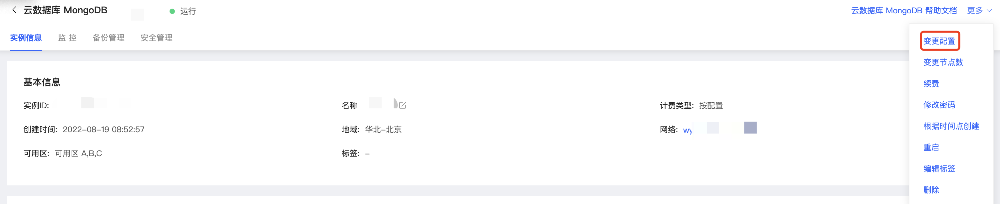

# 变更副本集规格

若当前MongoDB实例配置与您的业务应用要求不匹配，您可以通过变更副本集的实例配置以满足业务需求。MongoDB实例支持变更的配置项包括：

- 规格，即实例被分配的CPU核数和内存容量；
- 存储空间，即实例被分配的磁盘容量。

## 注意事项

- 计费类型为按配置的实例，支持升/降实例配置；

- 当需要降低存储规格时，请您谨慎操作，否则可能会出现变配失败或因存储空间不足导致实例被锁定的情况；

- 计费类型为包年包月的实例，仅支持实例规格的升级，不支持降级；

- 变更实例配置时不支持变更副本集节点数量；

- 变更实例规格的过程中可能会出现闪断、主从节点切换的情况，请务必确保使用Connection String URI的方式连接MongoDB实例；

- 存储类型不支持更改，即实例始终保持创建时所选用的本地盘或者云盘的存储形式。

  

## 计费说明

在您更改实例配置后，您后续将按照新配置标准收费，请您参照实例价格文档。

## 操作步骤

1. 登录[MongoDB控制台](https://mongodb-console.jdcloud.com/mongodb)；

2. 在实例列表页面，选择需要更换配置的**副本集实例**，在**操作**列中点击更多，在下拉菜单中点击**变更配置**；

   

3. 在变更配置的弹窗中选配需要变更的实例规格，具体字段说明如下：

| 字段名称 | 字段说明                                                     |
| -------- | ------------------------------------------------------------ |
| 节点数   | 变更实例配置时不可变更节点数                                 |
| 规格     | 实例所占有的CPU和内存规格，按配置可升降配置，包年包月不可降配 |
| 存储类型 | 本地盘或者SSD云盘                                            |
| 存储空间 | 更改配置后实例所占用的存储空间                               |
| 网络     | 当前实例所处的私有网络与子网，不可更改                       |
| 计费类型 | 当前实例的计费类型，不可更改                                 |

## 相关API

| 接口名称                                                     | 接口说明     |
| ------------------------------------------------------------ | ------------ |
| [modifyInstanceSpec](../../../../../../API/JCS-for-MongoDB/Instance-Management/modifyInstanceSpec.md) | 变更实例规格 |