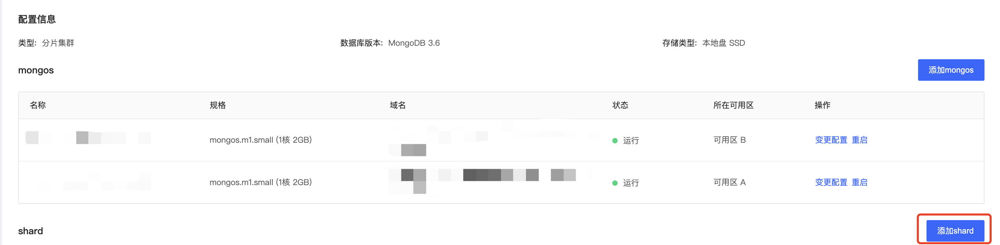

# 变更Shard节点数量

您可以通过京东云MongoDB控制台添加分片集群中的Shard节点。

## 注意事项

- 添加的Shard节点默认为同MongoDB数据库版本，不支持不同版本的添加；

- 添加节点时实例仍可正常运行，且不可对实例所有节点进行其他操作；

- 最多支持存在32个Shard节点，请您按照余量提示添加，避免添加失败的情况。

## 计费规则

在您更改节点数后，您后续将按照新配置标准收费，请您参照[实例价格](../../../Pricing/Price-Of-Instance.md)文档。

## 操作步骤

1. 登录[MongoDB控制台](https://mongodb-console.jdcloud.com/mongodb)；

2. 在**实例列表**页面筛选相应的分片集群实例，点击实例名称进入**实例详情**页；

3. 在实例信息标签页下找到配置信息模块；

4. 点击Shard展示模块内点击添加Shard按钮；

   

5. 在添加Shard的弹窗中选择需要新增的Shard节点配置，具体字段说明如下：

   | 字段名称                   | 字段说明                                              |
   | -------------------------- | ----------------------------------------------------- |
   | 规格                       | 新添加的Mongos所占用的CPU和内存                       |
   | 节点数                     | 需要添加的节点数量，运行中的Shard数量合计不可超过32个 |
   | 网络                       | 虚拟网络和子网名称                                    |
   | 计费类型                   | 目前实例的计费类型，添加Mongos节点时默认且不可修改    |
   | 到期时间（包年包月可显示） | 包年包月实例到期时间                                  |
   | 费用                       | 添加Shard节点的费用统计                               |

6. 确认无误后点击确定，进入缴费界面再次确认订单无误，点击立即支付后返回控制台，等待节点添加完成后可在该实例的实例详情页查看具体配置信息。

