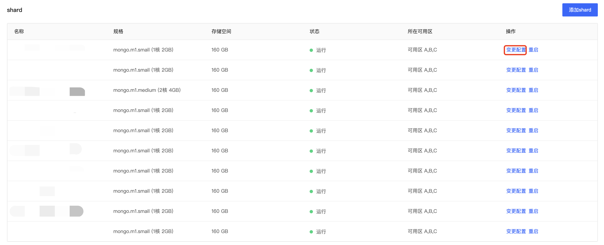

# 变更Shard节点配置

您可以通过更改Mongos节点配置以满足您业务的部署需求。

## 注意事项

- Mongos节点配置默认选取同数据库版本，不支持更改；

- 变更节点配置时可能会出现无法连接的状况，请您注意配置更改的操作时间，避免对业务产生影响；

- 变更节点配置后可能会导致主从切换等状况，请及时验证数据库连接的有效性；

- 包年包月实例不支持降低配置操作；

- Shard节点变更配置时，所选存储空间不应小于原节点存储空间，避免节点创建失败。

  

## 前提条件

实例状态为运行且计费正常的实例，可执行变更配置操作。

## 使用说明

在您更改实例配置后，您后续将按照新配置标准收费，请您参照实例价格文档。

## 操作步骤

1. 登录[MongoDB控制台](https://mongodb-console.jdcloud.com/mongodb)；

2. 在实例列表页面筛选相应的分片集群实例，点击实例名称进入**实例详情**页；

3. 在**实例信息**标签页下找到**配置信息模块**；

4. 点击Mongos展示模块内选择需要变更配置的Mongos节点；

5. 在添加Mongos的弹窗中选择需要变更的Mongos节点配置；

   

6. 具体字段说明如下：

   | 字段名称                   | 字段说明                                           |
   | -------------------------- | -------------------------------------------------- |
   | 存储类型                   | 仅可选择与实例创建时所选存储类型相同的存储方式     |
   | 规格                       | 目标CPU占用量以及内存占用量                        |
   | 存储空间                   | 更改配置后节点存储空间大小                         |
   | 网络                       | 虚拟网络和子网名称                                 |
   | 计费类型                   | 目前实例的计费类型，添加Mongos节点时默认且不可修改 |
   | 到期时间（包年包月可显示） | 包年包月实例的到期时间                             |
   | 费用                       | 添加Mongos节点的费用统计                           |

7. 确认目标配置无误后点击确定，进入缴费界面再次确认订单无误，点击立即支付后返回控制台，等待节点添加完成后可在该实例的实例详情页查看具体配置信息。