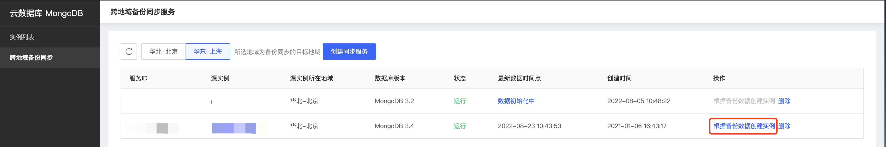

# 根据跨地域备份创建

京东云MongoDB数据库提供基于跨地域备份服务同步的全量备份与增量备份，您可以选择7天内的任意时间点，快速创建新的MongoDB实例。

## 注意事项

- 新势力的存储空间不应小于源实例，否则可能创建失败；

- 创建完成时间与源实例的数据量大小有关，通常在几分钟至数小时内完成。

## 操作步骤

1. 登录[MongoDB控制台](https://mongodb-console.jdcloud.com/mongodb)，

2. 点击左侧列表中的**跨地域备份同步**标签，进入相应页面；

3. 在实例备份列表中筛选需要使用的**同步实例备份**，点击操作列中的根据备份数据创建实例；

   

   

4. 在根据备份数据创建实例页面中选择配置，字段说明如下：

   | 字段名称             | 字段说明                                                     |
   | -------------------- | ------------------------------------------------------------ |
   | 计费类型             | 仅支持包年包月和按配置付费两种付费模式，关于付费模式的介绍请参见计费文档 |
   | 时间                 | 创建实例所需要的某时间点的实例数据                           |
   | 地域                 | 跨地域同步的目标地域。                                       |
   | 实例类型             | 副本集或者分片集群架构，默认与源实例相同不支持修改           |
   | 数据库版本           | 默认为源实例数据库版本，不支持更改                           |
   | 节点数               | 可自定义选择3、5、7节点的副本集架构                          |
   | 存储类型             | 本地盘或者SSD云盘的存储形式                                  |
   | 规格                 | 实例所占用的CPU和内存资源大小                                |
   | 存储空间             | 实例所占用的存储资源大小                                     |
   | 网络                 | 私有网络及子网                                               |
   | 部署方式             | 是否使用多可用区部署方式                                     |
   | 密码                 | 可自定义选择修改root密码的方式                               |
   | 购买时长（包年包月） | 包年包月的购买时长                                           |
   | 自动续费（包年包月） | 是否允许在账户余额充足的情况下进行自动续费                   |
   | 源实例ID             | 源实例的唯一识别ID                                           |
   | 源实例名称           | 源实例的自定义名称                                           |

5. 确认配置后点击立即购买，进入订单确认页面；

6. 确认订单信息并阅读勾选《云数据库MongoDB服务条款》，点击立即支付；

7. 支付完成后请返回控制台，等待实例创建完成。