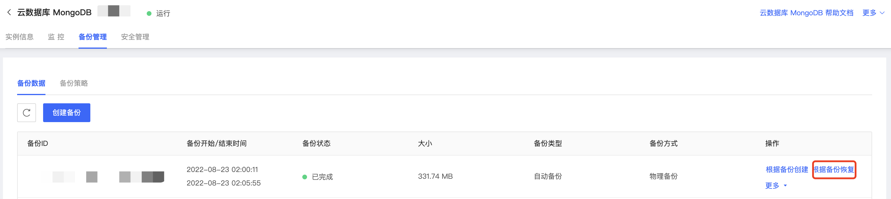

# 根据备份恢复

京东云MongoDB控制台提供了根据备份文件恢复实例的功能，即可根据备份恢复相应实例的数据。

## 注意事项

- 新实例创建过程中请勿删除使用的备份，否则会恢复失败；
- 数据恢复时，实例不可进行任何操作；
- 在使用备份文件进行恢复时会导致现有数据丢失，请谨慎操作；
- 数据恢复期间会造成业务连接中断，请合理安排数据恢复时间。

## 操作步骤

1. 登录[MongoDB控制台](https://mongodb-console.jdcloud.com/mongodb)；

2. 在实例列表页筛选目标实例，点击实例名称进入实例详情页；

3. 点击上方标签中的备份管理进入备份数据页面；

4. 选择需要恢复的备份文件，点击操作列中的根据备份恢复；

   

5. 在弹出框中点击确认。