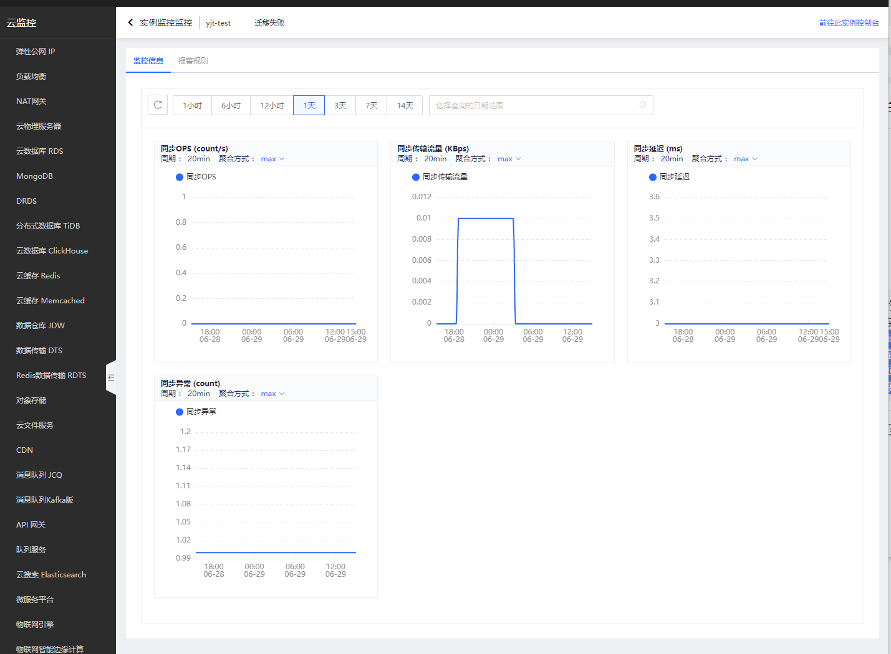
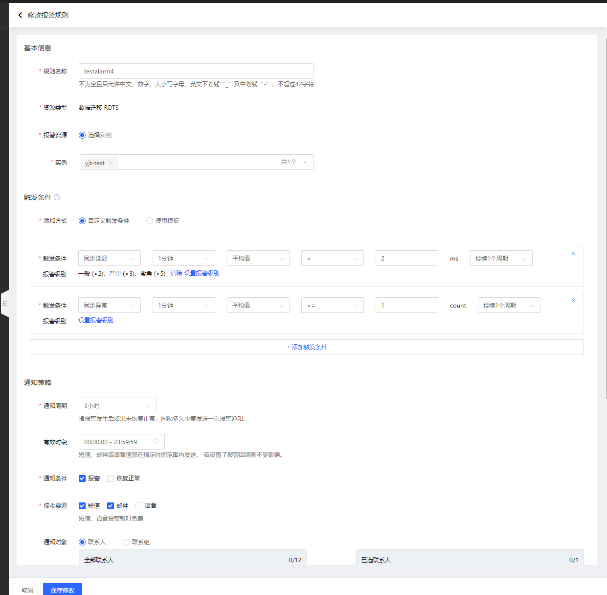
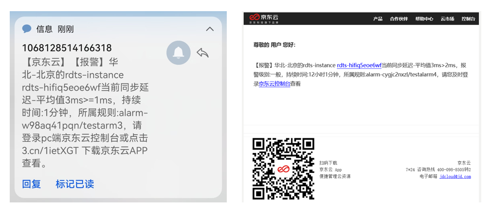
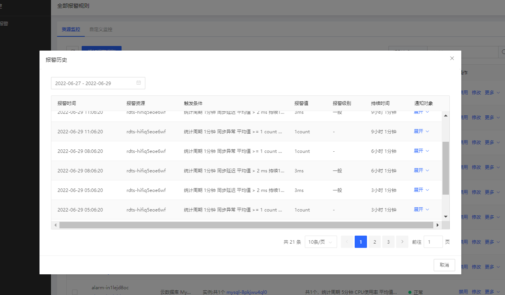

# 迁移的监控报警配置

当迁移任务创建成功后，您可以进一步配置增量延迟监控和同步中断异常监控。当任务创建完成后且为“待迁移”状态时，云监控将自动进行迁移监控，您可以这时继续设置报警信息。

## 设置入口

- RDTS产品中，任务列表->任务->操作->监控。下文以该入口进行操作说明。

- 云监控产品中，资源监控->Redis数据传输RDTS->任务列表->任务->操作->监控、报警规则

## 操作步骤

【Step1】进入迁移任务列表， 选择“待迁移”任务，点击“监控”操作

 
【Step2】进入监控页，可查看到对迁移过程监控的指标，包含 同步OPS、同步传输流量、同步延迟、同步异常。
 

 
【Step3】配置报警规则，点击添加报警规则

1、	同步延迟 报警设置，可配置ms级别的监控，RDTS上报的最小的延迟是2ms，配置大于等于2ms的监控，即可收到报警。
 

2、	同步异常 报警配置：异常的上报为0和1.  0为正常、1为异常。

3、在 全部报警规则 页面中，可查看历史报警监控
 
 

 
 
##  常见的异常问题

| 异常问题                 | 建议处理方式                                   |
| :--  | :-- |
| 源端类型校验失败         | 输入的源端类型和实际不符                       |
| 源端配置校验失败         | 检查输入的源端配置                             |
| 目的端类型校验失败       | 输入的目的端类型和实际不符                     |
| 目的端配置校验失败       | 检查输入的目的端配置                           |
| 源端time校验失败         | 检查源端机器时间                               |
| 子网IP不足               | 删除子网内不用的实例，或者使用剩余IP较多的子网 |
| 目的端有数据             | 清空目的端                                     |
| 同步任务超时             | 默认时间内未完成数据同步，请重新迁移           |
| 数据校验失败             | 同步完成后，存在数据不一致情况                 |
| 同步工具与源端连接异常   | 同步工具与源端异常断开，请联系我们             |
| 目的端返回错误           | 同步工具收到目的端异常返回，请联系我们         |
| 同步工具与目的端连接异常 | 同步工具与目的端异常断开，请联系我们           |
| 同步工具写目的端失败     | 同步工具向目的端同步失败，请联系我们           |

