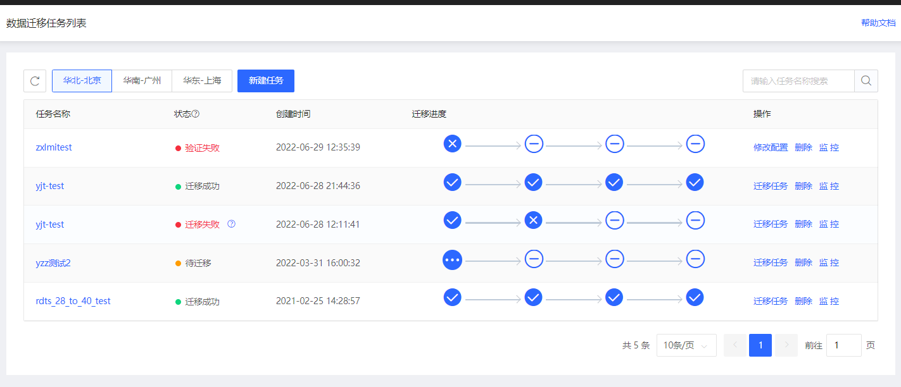
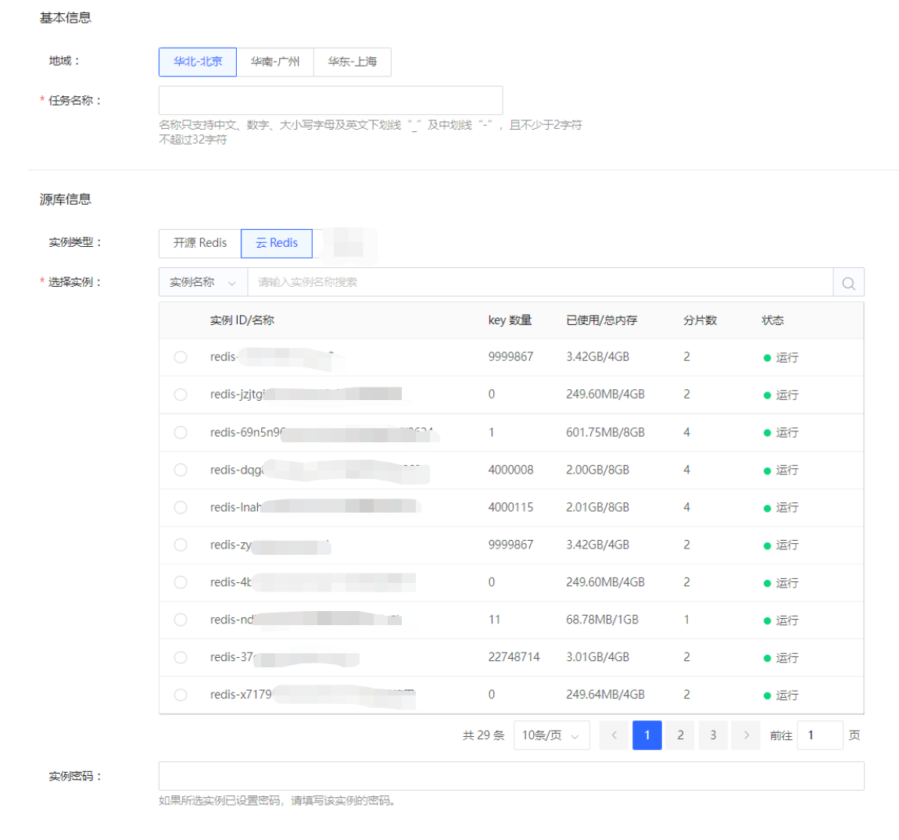
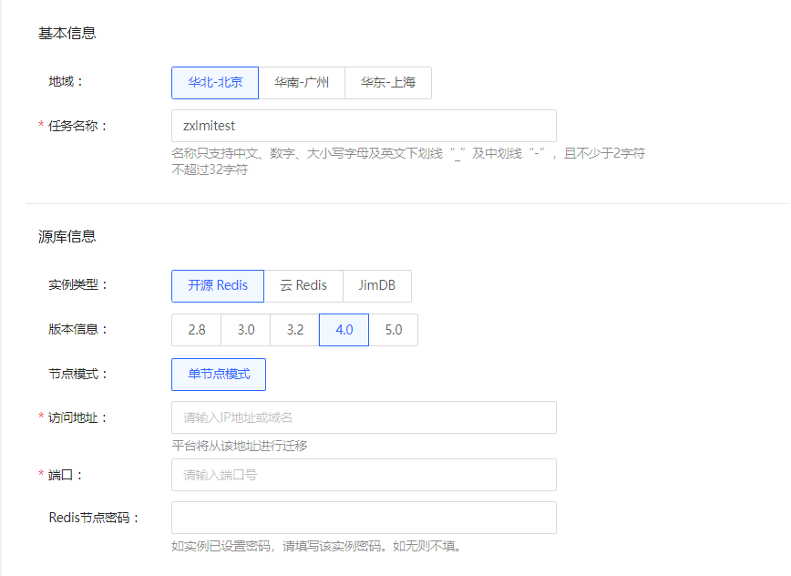
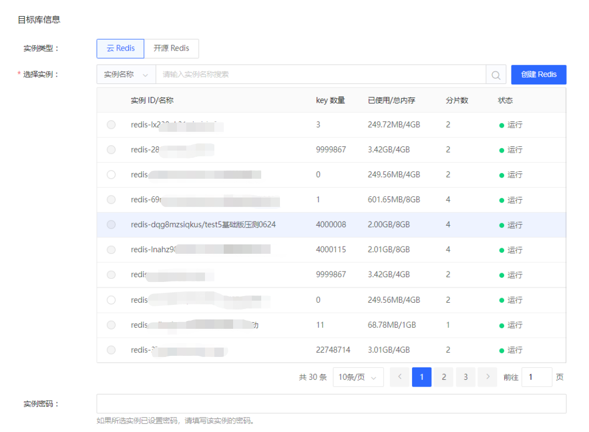
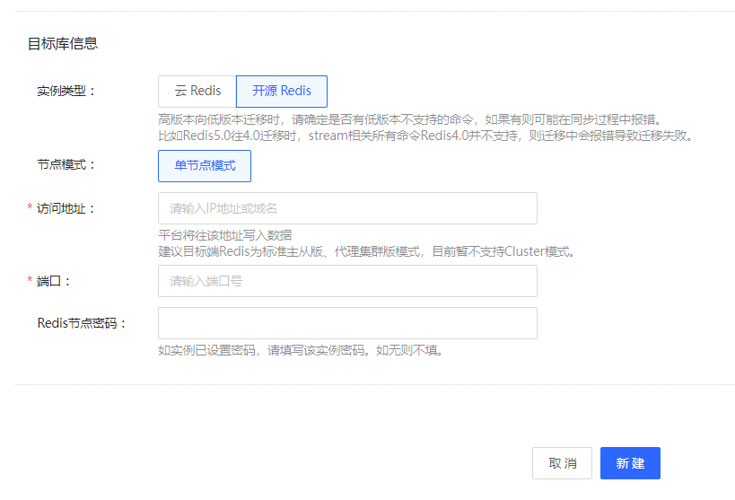
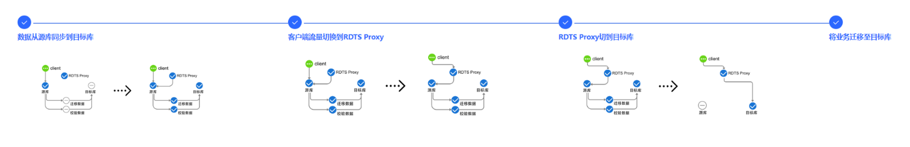
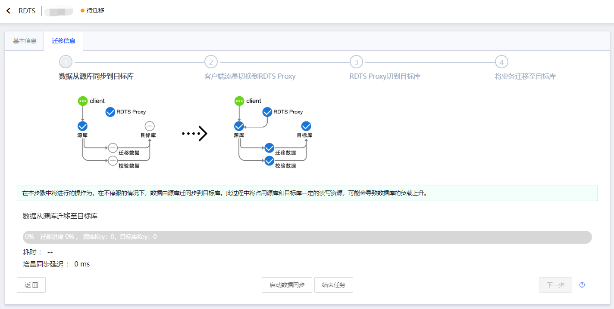
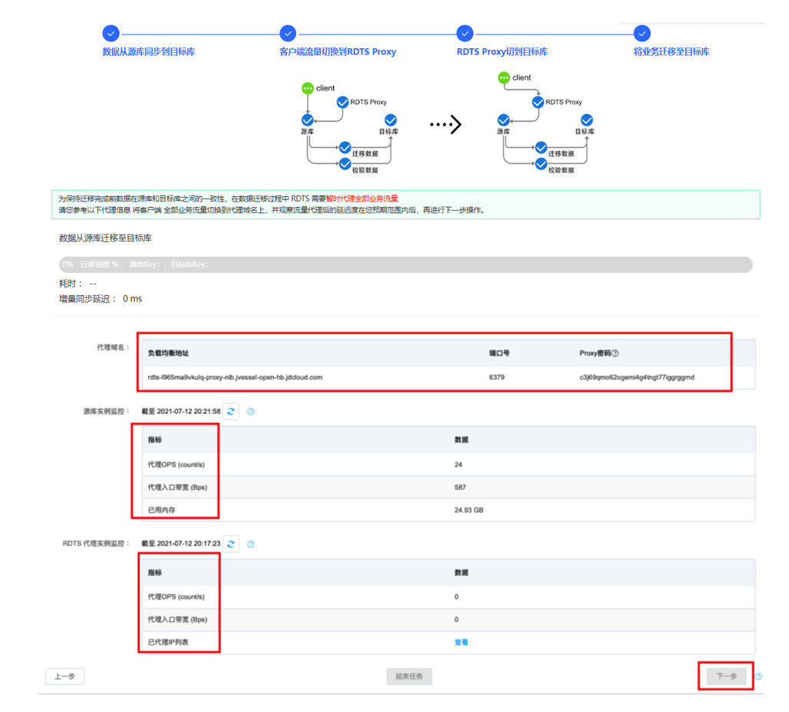
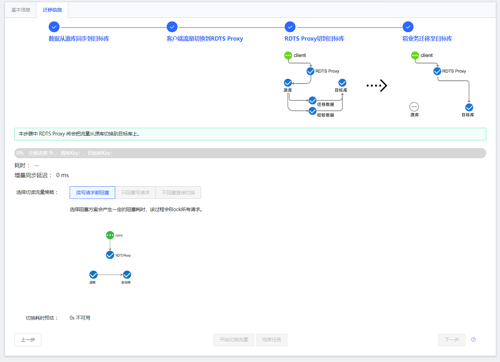
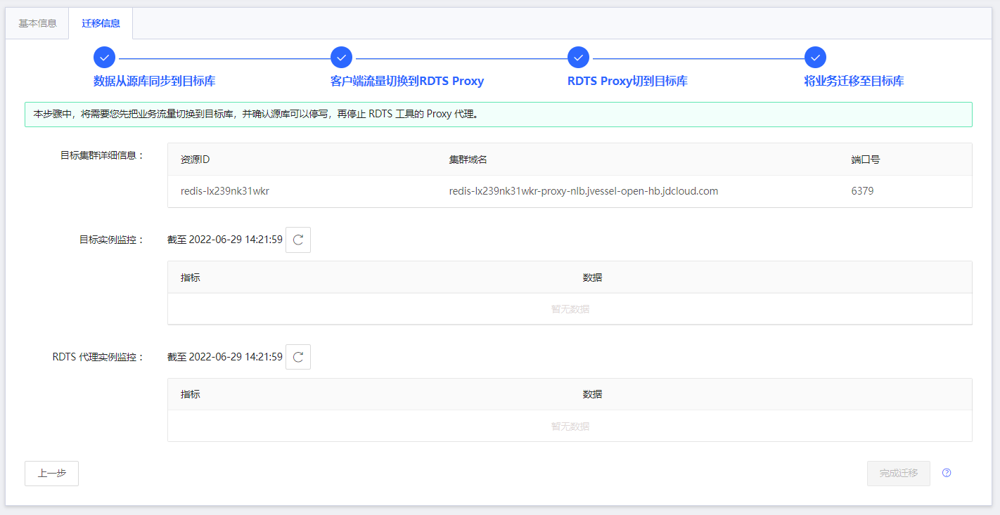

# 使用云上工具RDTS进行单向数据迁移

目前，RDTS工具支持进行单向数据迁移。

##   前提条件

1.	需提前在控制台创建好目标云缓存Redis 实例。

3.	在迁移前，需要保证目标Redis实例没有数据，或已有数据对业务无影响且可允许被删除。

| 源库 |  目标库  | 
| :--- | :---  | 
|  云缓存Redis、云主机自建Redis、通过专线链接的自建Redis |  云缓存Redis4.0、自建Redis | 

##   创建任务

【Step1】登录  [控制台](https://rdts-console.jdcloud.com/list/cn-north-1) ，进入RDTS的任务列表页，选择源库或目标库所在的地域。

【Step2】创建任务，配置源库和目标库信息。保存配置后，平台将自动进行任务校验。

1、源库支持 开源Redis和云Redis两种实例类型。

1）	对于云Redis，只有运行状态的正常Redis实例可支持迁移，每次只支持选择1个Redis实例进行迁移

2）	对于开源Redis，Redis需符合开源Redis协议；目前可支持单点模式迁移；版本可支持2.8、3.0、3.2、4.0、5.0。

- 对于主从标准版实例，建议填写从节点地址

- 如果redis节点没有密码，可不填写

2、目标库支持：云Redis和开源Redis

1）	对于目标端为云Redis，可支持向云Redis2.8、4.0同步数据。对于源端为单点模式、云Redis场景下，目标端支持标准版、proxy集群版。

2）	对于目标端为开源Redis，Redis需符合开源Redis协议。

同时需要注意，如果是高版本向低版本迁移时，需要确定是否有低版本不支持的命令，如果有则可能在数据同步过程中报错。比如Redis5.0往4.0迁移时，stream相关所有命令Redis4.0并不支持，则迁移中会报错导致迁移失败。

3、点击创建任务后，平台将自动进行任务校验。

如果点击创后直接报错内部错误，表示校验项检查未通过，常见于自建Redis，您需要重新检查源端或者目标端的配置是否正确，网络是否互通。

如果正常创建任务后，在列表页任务状态为验证失败：表示校验项检查未通过，您需要重新检查源端或者目标端的配置是否正确。

任务创建通常耗时1分钟 - 2分钟，创建成功后，任务状态变为待迁移状态，表示您可准备开始迁移。

##  数据迁移

迁移任务的全流程包含4步骤，每步完成的工作内容如下。如您只需要做数据迁移工作，可只使用第一步的数据从源库迁移到目标库的功能。迁移任务的状态，请参考前文。

【Step1】数据从源库同步到目标库

进入迁移页面，点击“启动数据同步”即可开始迁移。在本步骤中将进行的操作为，在不停服的情况下，数据由源库迁同步到目标库。

注意：源端需要支持psync或sync命令，并且有写的权限

此过程中将占用源库和目标库一定的读写资源，可能会导致数据库的负载上升。迁移过程中，将为您提供迁移进度、源库和目标库key数量、已耗时长、增量同步延迟信息，以便您查看同步进度。其中：

- 实际迁移耗时将依赖于您的数据量大小。迁移完成后，平台还将自动进行数据一致性校验。

- 还可在监控报警中，为增量同步过程配置延迟、同步中断异常配置报警，在后文将介绍配置过程。

【Step2】可选步骤。迁移超时或失败，则可重新迁移

当迁移状态为 同步超时（migrateTimeout）、或者同步失败（migrateFailed）的情况下，可以进行重新迁移。重新迁移对源端数据无影响，会对目标端数据库进行全部数据重新开始迁移。

【Step3】Step3和Step4均为可选。如果您需要使用RDTS来做流量切换，则可选择使用本操作来完成客户端流量切换到RDTS Proxy；也可不使用该功能，自行监控源端和目标端的流量情况，操作业务的流量切换。

如果您使用该功能，那么接下来您将需要进行两次上线操作。在本步骤中，需要您上线应用的配置，将应用切换到RDTS，由RDTS暂时代理您的全部业务流量并进行流量切读到目标端。在Step5中，修改应用指向目的集群，重新上线。

可参考控制台上代理部分的信息。将客户端 全部业务流量切换到代理域名上后，可对 流量代理后的实例进行监控，当流量监控结果达到您预期范围后，再进行下一步操作。

| 配置项 |  说明  | 
| :--- | :---  | 
|  代理域名 |  代理域名各项信息记录了迁移代理域名、密码、端口   | 
|  源库实例监控 |  源端实时流量监控。  | 
|  RDTS代理实例监控 | RDTS代理实时流量监控。在把应用流量指向迁移代理后，需要确保源端和rdts端流量差不多时才可以执行 右下角下一步按钮。   | 

特别注意：需要确保全部流量都切换到了迁移代理，这里可以参考以下内容 ：

1、ip 列表，可用于校验。

2、源端集群的客户端列表应该为0。

【Step4】RDTS进行流量切换到目标端。系统提供了三种切换策略，您需要根据业务需求选择策略，默认情况选择读写都阻塞。

| 切读流量策略 |  说明  | 
| :--- | :---  | 
|  读写请求都阻塞 |  选择阻塞方案会产生一定的阻塞耗时，该过程会Block所有请求。  | 
|  只阻塞写请求 |  该切换过程对源库采用readonly模式，会产生一定的阻塞耗时。  | 
|  不阻塞直接切换 | 流量将直接切换到目标库，可能会产生源库和目标库数据不一致。   | 

【Step5】将业务迁移至目标库。将需要您重新上线配置，修改应用地址指向目的集群。您可以通过观测目标实例和RDTS代理实例监控图，观测业务流量是否已切换到目标库，若切换完成则代理监控数据应为0，并确认源库可以停写。
最后，点击“完成迁移”可释放迁移资源。

